<div align="center">

# ⚡ RESOLVE.AI

### Autonomous Agentic Customer-Operations Platform
**From customer issue to verified resolution — autonomously.**

<p align="center">
  <em>Theme: Agentic AI & Intelligent Systems &nbsp;|&nbsp; Hackathon Submission</em>
</p>

<p align="center">
  <a href="https://astra4-delta.vercel.app/">
    
  </a>
  <a href="https://github.com/shreyash-bhosale/Astra-4">
    
  </a>
  <a href="./docs/screenshots/resolveai-demo-walkthrough.gif">
    
  </a>
</p>

<p align="center">
  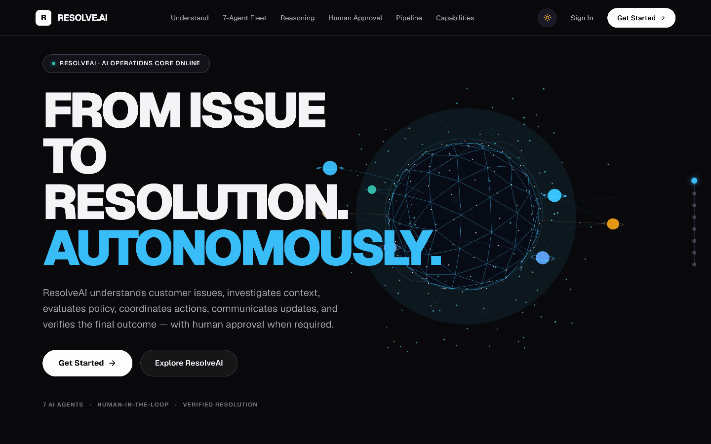
</p>

<p align="center">
  
  
  
  
  
  
  
</p>

</div>

---

## 📑 Table of Contents

1. [What is ResolveAI?](#-what-is-resolveai)
2. [Problem Statement & Value](#-problem-statement--value)
3. [The Solution: Autonomous Agentic Operations](#-the-solution-autonomous-agentic-operations)
4. [Live Demo & Video Walkthrough](#-live-demo--video-walkthrough)
5. [User Interface & Screenshots](#-user-interface--screenshots)
6. [Key Features](#-key-features)
7. [AI & Multi-Agent Architecture](#-ai--multi-agent-architecture)
8. [Detailed 7-Agent Fleet Breakdown](#-detailed-7-agent-fleet-breakdown)
9. [End-to-End Workflow & State Machine](#-end-to-end-workflow--state-machine)
10. [Human-in-the-Loop (HITL) Safety Gate](#-human-in-the-loop-hitl-safety-gate)
11. [AI Security & Defense in Depth](#-ai-security--defense-in-depth)
12. [System Architecture Diagram](#-system-architecture-diagram)
13. [Product Flow Diagram](#-product-flow-diagram)
14. [Example User Journey](#-example-user-journey)
15. [Technology Stack](#-technology-stack)
16. [Repository & Project Structure](#-repository--project-structure)
17. [REST API Documentation](#-rest-api-documentation)
18. [Database Architecture & Schema](#-database-architecture--schema)
19. [Authentication & Role-Based Access](#-authentication--role-based-access)
20. [Environment Variables](#-environment-variables)
21. [Local Quickstart & Installation](#-local-quickstart--installation)
22. [Automated Testing](#-automated-testing)
23. [Production Deployment Guide](#-production-deployment-guide)
24. [Hackathon Judge 3-Minute Demo Script](#-hackathon-judge-3-minute-demo-script)
25. [Future Roadmap](#-future-roadmap)
26. [License & Team](#-license--team)

---

## 💡 What is ResolveAI?

**ResolveAI** is a full-stack, enterprise-grade **agentic customer-operations platform** that autonomously investigates customer support tickets, plans multi-step resolution paths, queries internal enterprise systems, reasons against company warranty and return policies, coordinates specialized AI agents, and enforces strict **Human-in-the-Loop supervisor authorization gates** before executing real actions.

Unlike conversational chatbots that simply generate conversational text, ResolveAI operates as an **actionable, auditable autonomous operations engine**:
* It **investigates** CRM databases, order records, and carrier tracking timestamps.
* It **evaluates** legal policies and warranty coverage windows deterministically.
* It **provisions** real warehouse replacement orders and status updates through gated tools.
* It **composes** empathetic, hallucination-free customer notifications based purely on verified evidence dossiers.
* It **audits** every resolution with an independent 5-point verification gate before any ticket can be closed.
* It **logs** an immutable audit trail of every agent action, thought, tool execution, and supervisor signature.

---

## 🎯 Problem Statement & Value

### The Real-World Pain
Modern customer operations teams at e-commerce, consumer electronics, and SaaS companies suffer from severe operational friction:
1. **Fragmented Data Silos:** Support representatives waste 70% of case handling time toggling between ticket queues (Zendesk), CRM customer profiles (Salesforce), order management systems (Shopify/ERP), carrier tracking portals (FedEx/UPS), and internal policy documents.
2. **Repetitive Calculation Fatigue:** Agents manually compute whether a damaged item arrived within a 14-day warranty policy window or verify whether an order is eligible for pre-dispatch cancellation.
3. **The "Black-Box" Bot Risk:** Conventional LLM chatbots frequently hallucinate false promises to customers (e.g., promising full refunds outside policy) or lack the programmatic safety controls required to execute internal tools without runaway financial or inventory risk.
4. **Zero Auditability:** Standard support software fails to capture a transparent chain of reasoning showing *why* a replacement was approved, *which* policy clause applied, and *who* verified the evidence.

### The ResolveAI Value
* **Autonomous Resolution:** Resolves routine warranty claims, defective product replacements, wrong shipments, and pre-dispatch cancellations in seconds rather than hours.
* **Deterministic Policy Enforcement:** Eliminates human error by programmatically evaluating policy clauses against verifiable timestamps.
* **Guaranteed Financial Safety:** Sensitive operations (replacements, large refunds) are physically halted at a supervisor approval gate until authorized.
* **Complete Explainability:** An immutable 18-point audit log records every single agent thought, tool call parameter, policy citation, and human decision.

---

## 🛠️ The Solution: Autonomous Agentic Operations

ResolveAI replaces manual triage and fragmented workflows with a collaborative **7-Agent Autonomous Fleet**:

```
[ Incoming Customer Ticket ]
            │
            ▼
[ ◉ Orchestrator Agent ] ────────── Formulates 6-Step Dynamic DAG Plan
            │
      ┌─────┴──────────────────┐
      ▼                        ▼
[ △ Triage Agent ]      [ ⌕ Investigation Agent ]
Classifies Intent,      Queries CRM, Orders &
Urgency & Entities      Calculates Delivery Age
      │                        │
      └─────┬──────────────────┘
            │ Evidence Dossier
            ▼
   [ ▣ Policy Agent ] ──────── Cross-References Active Policy DB
            │
   Action High Risk?
     /            \
   YES             NO
   /                \
[ ⚠ Human Gate ]     \
Supervisor Authorizes \
   \                  /
    └───────┬────────┘
            ▼
   [ ⚡ Action Agent ] ──────── Executes Gated Internal Tools (Warehouse Dispatch)
            │
            ▼
[ ✦ Communication Agent ] ── Composes Fact-Checked Personalized Customer Email
            │
            ▼
 [ ✓ Verification Agent ] ── Executes Independent 5-Point Audit Checklist
            │
            ▼
[ ✅ Case Verified & Resolved ] + Immutable Audit Trail
```

---

## 🎥 Live Demo & Video Walkthrough

| Resource | Link | Description |
| :--- | :--- | :--- |
| **Demo Walkthrough Video** | [`[▶️ Watch Animated Video Walkthrough]`](./docs/screenshots/resolveai-demo-walkthrough.gif) | Complete animated resolution walkthrough: multi-agent DAG execution, approval gating, and autonomous resolution. |
| **Live Web App** | [`https://astra4-delta.vercel.app/`](https://astra4-delta.vercel.app/) | Production web application with Dark/Light mode and interactive 3D hero. |
| **GitHub Repository** | [`https://github.com/shreyash-bhosale/Astra-4`](https://github.com/shreyash-bhosale/Astra-4) | Complete full-stack codebase with frontend, backend, test suite, and schema. |

---

## 🖼️ User Interface & Screenshots Gallery

ResolveAI is designed with a **futuristic liquid-metal aesthetic**, editorial typography, high-contrast dark mode (default) and light mode, and responsive 12-column layouts.

### 1. Futuristic Liquid-Metal Landing Page Hero (Dark Mode & Light Mode)
<p align="center">
  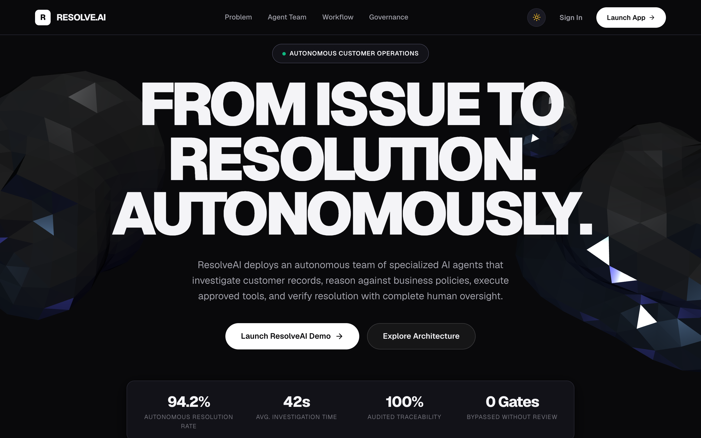
  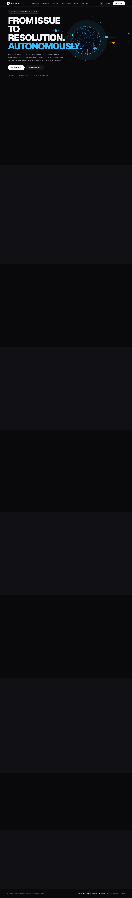
</p>

### 2. Autonomous Multi-Agent Fleet Showcase & Interactive Monitor
<p align="center">
  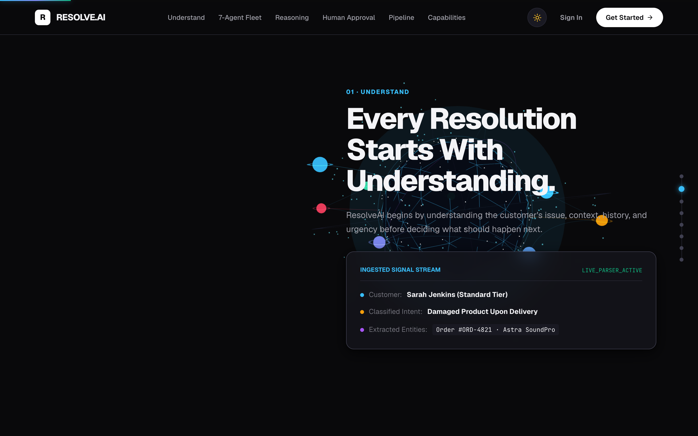
</p>

### 3. Operations Dashboard & Real-Time Fleet Health
<p align="center">
  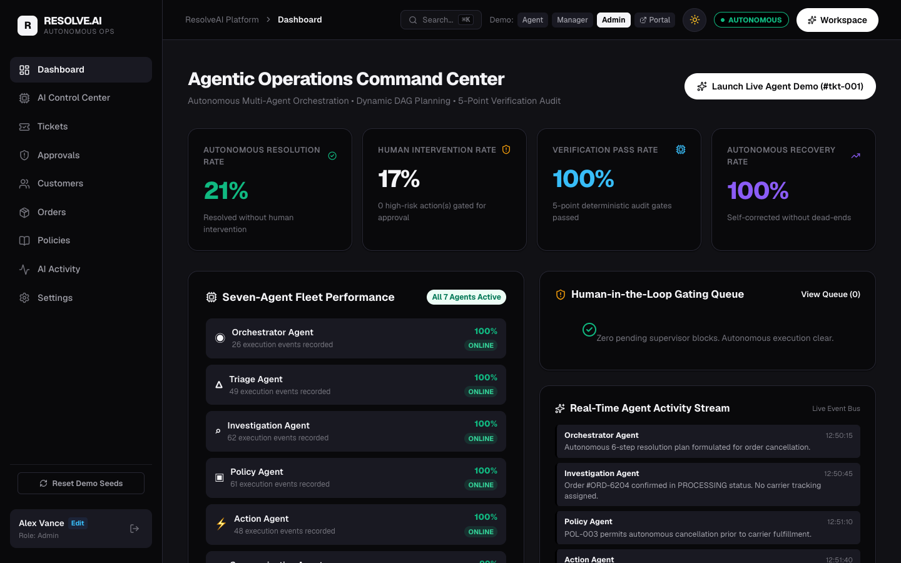
</p>

### 4. Interactive 6-Step DAG Execution Workspace & Human-in-the-Loop Gate
<p align="center">
  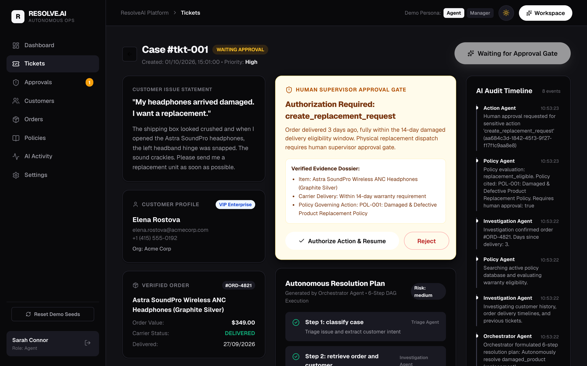
  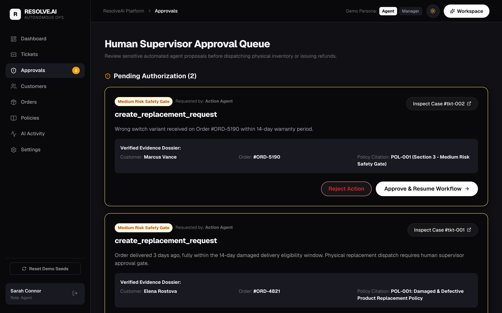
</p>

### 5. Verified Case Resolution with Immutable Audit Trail
<p align="center">
  
</p>

### 6. Rapid Evaluation Login Screen with 1-Click Demo Personas
<p align="center">
  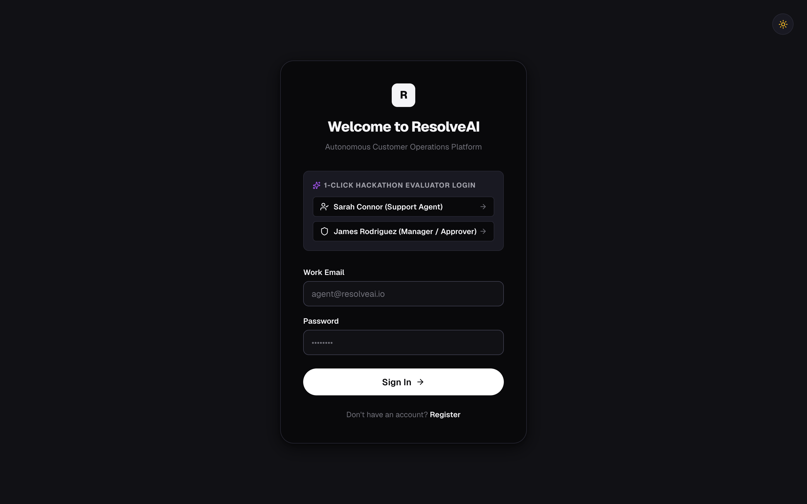
</p>

---

## 🌟 Key Features

### 1. 3D Liquid-Metal Hero Experience
* Developed in pure **Three.js** using `MeshPhysicalMaterial` (`roughness: 0.08`, `metalness: 0.98`, `clearcoat: 1.0`).
* Procedurally generates organic liquid chrome ribbon sculptures and mercury droplets.
* Studio lighting dynamically recalibrates when toggling between Dark Mode (obsidian specular highlights) and Light Mode (bright studio chrome).
* Features pointer-driven micro-parallax and respects `@media (prefers-reduced-motion: reduce)`.

### 2. Autonomous Multi-Agent Resolution Engine
* Coordinates 7 specialized agents via a dynamic Directed Acyclic Graph (DAG) state machine.
* Connects to **Google Gemini Flash** (`gemini-flash-latest` / `gemini-3.5-flash`) with structured JSON schema outputs.
* **Deterministic Fallback Engine:** Features built-in heuristic reasoning fallbacks that guarantee instantaneous zero-downtime execution even during Google AI Studio rate limits (429) or outage spikes (503).

### 3. Human-in-the-Loop (HITL) Authorization Queue
* Actions evaluated as Medium or High Risk (such as physical warehouse dispatch or monetary transactions > $150) are physically paused.
* Dedicated **Supervisor Approval Queue** presents full evidence dossiers, policy citations, and customer history.
* Supervisors can **Authorize & Resume** or **Reject** with custom reviewer notes.

### 4. Verified Customer Communication
* The Communication Agent synthesizes only verified evidence from the investigation dossier.
* Prevents LLM hallucinations: will never promise discounts, shipping dates, or refunds not explicitly authorized by the Policy and Action agents.

### 5. Independent 5-Point Verification Audit
* Before closing any ticket, the Verification Agent audits:
  1. Have all planned DAG steps completed?
  2. Is the customer and order evidence dossier complete?
  3. Does the solution strictly adhere to company policy?
  4. Was required supervisor approval obtained and logged?
  5. Was the customer informed with accurate context?

### 6. 1-Click Hackathon Evaluator Persona Logins
* Immediate 1-click authentication buttons for **Sarah Connor (Support Agent)**, **James Rodriguez (Manager/Approver)**, and **Alex Vance (Administrator)** with pre-seeded credentials.

### 7. Dual Theme System (Dark Mode Default)
* Built on CSS custom properties (`--bg-primary: #09090b`, `--text-primary: #f4f4f7`).
* Includes one-click `ThemeToggle` across the landing page, login, register, and dashboard layout.
* Scroll-driven reveal animations using GPU-accelerated transforms and `IntersectionObserver`.

---

## 🧠 AI & Multi-Agent Architecture

ResolveAI avoids the unreliability of monolithic single-prompt LLMs by adopting a **specialized, decoupled multi-agent topology**:

| Agent | Icon | Specialized Responsibility | Internal Tools Used | Zod Output Schema |
| :--- | :---: | :--- | :--- | :--- |
| **Orchestrator Agent** | `◉` | Formulates 6-step DAG plan, manages execution transitions, enforces dependencies, handles pause/resume. | DAG State Machine | `PlanOutputSchema` |
| **Triage Agent** | `△` | Analyzes ticket title/description, extracts entities (order IDs, product names), classifies intent & urgency. | Semantic Classifier | `TriageOutputSchema` |
| **Investigation Agent** | `⌕` | Queries CRM databases, retrieves transaction records, computes carrier delivery age against warranty window. | `getCustomer()`, `getOrder()`, `getCustomerOrders()`, `getTicketHistory()` | `InvestigationOutputSchema` |
| **Policy Agent** | `▣` | Searches active policy database, evaluates warranty rules against evidence, flags required approvals. | `searchPolicies()` | `PolicyOutputSchema` |
| **Action Agent** | `⚡` | Executes allowlisted internal tools. Pauses at approval gate on sensitive operations. | `createReplacementRequest()`, `updateTicketStatus()`, `createInternalTask()`, `createEscalation()` | `ActionOutputSchema` |
| **Communication Agent** | `✦` | Drafts personalized customer resolution emails and internal briefings strictly grounded in verified facts. | Contextual Formatter | `CommunicationOutputSchema` |
| **Verification Agent** | `✓` | Independent auditor running a 5-point verification checklist before authorizing final ticket closure. | Audit Validator | `VerificationOutputSchema` |

---

## 📋 Detailed 7-Agent Fleet Breakdown

### 1. ◉ Orchestrator Agent (`backend/src/agents/orchestrator.js`)
* **Role:** Master Planner & Coordinator.
* **Behavior:** When invoked on a ticket (`POST /api/tickets/:id/run`), it inspects the ticket context and builds a dynamic multi-step execution plan:
  * Step 1: `triage` (`Triage Agent`)
  * Step 2: `investigate` (`Investigation Agent`)
  * Step 3: `evaluate_policy` (`Policy Agent`)
  * Step 4: `execute_action` (`Action Agent` — with `requiresApproval` flag)
  * Step 5: `draft_response` (`Communication Agent`)
  * Step 6: `verify_resolution` (`Verification Agent`)
* **State Management:** When Step 4 encounters an action flagged with `requiresApproval: true`, the Orchestrator halts execution, transitions ticket status to `WAITING_APPROVAL`, logs an audit entry, and notifies the supervisor queue. Once approved, it picks up at Step 4 and executes the remaining pipeline.

### 2. △ Triage Agent (`backend/src/agents/triageAgent.js`)
* **Role:** Instant Intent & Urgency Classifier.
* **Behavior:** Extracts customer intent, determines issue category (`damaged_product`, `wrong_item`, `cancellation`, `refund_request`, `general`), assigns priority (`low`, `medium`, `high`, `urgent`), and detects missing entities.

### 3. ⌕ Investigation Agent (`backend/src/agents/investigationAgent.js`)
* **Role:** Autonomous Systems Investigator.
* **Behavior:** Cross-references the customer record, locates order history, calculates the exact number of days elapsed between order `delivery_date` and today, and compiles an evidence dossier.

### 4. ▣ Policy Agent (`backend/src/agents/policyAgent.js`)
* **Role:** Business Rule & Regulatory Reasoner.
* **Behavior:** Calls `searchPolicies()` to fetch active company policies (`POL-001` Damaged Product, `POL-002` Wrong Item, `POL-003` Cancellation, `POL-004` Refunds). Evaluates eligibility conditions (e.g. `daysSinceDelivery <= 14`) and flags whether supervisor approval is mandatory.

### 5. ⚡ Action Agent (`backend/src/agents/actionAgent.js`)
* **Role:** Gated Tool Execution Engine.
* **Behavior:** Executes allowlisted internal tools in `backend/src/tools/index.js`. If supervisor approval is required and has not yet been granted, it dispatches an approval request and halts. When authorized, it executes the action (e.g. provisions replacement order `REP-xxxx`) and updates records.

### 6. ✦ Communication Agent (`backend/src/agents/communicationAgent.js`)
* **Role:** Customer & Internal Briefing Writer.
* **Behavior:** Drafts a clear, polite, personalized customer resolution message with exact tracking or replacement numbers, strictly adhering to the facts in the evidence dossier.

### 7. ✓ Verification Agent (`backend/src/agents/verificationAgent.js`)
* **Role:** Resolution Auditor.
* **Behavior:** Evaluates the audit trail and prior step outcomes across 5 dimensions: (1) all steps executed, (2) evidence sufficient, (3) policy compliant, (4) approval obtained, and (5) customer informed. Only when all 5 pass does it set ticket status to `RESOLVED`.

---

## 🔄 End-to-End Workflow & State Machine

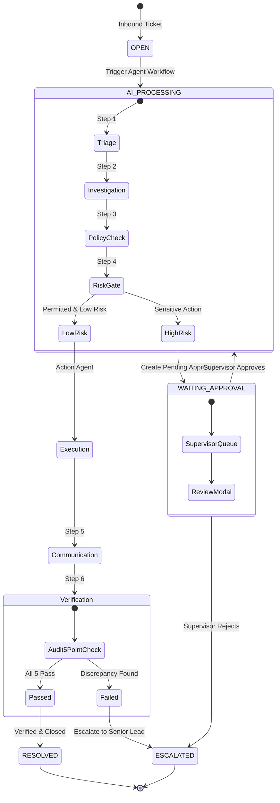

---

## 🛡️ Human-in-the-Loop (HITL) Safety Gate

ResolveAI enforces a strict boundary between **autonomous reasoning** and **consequential execution**:

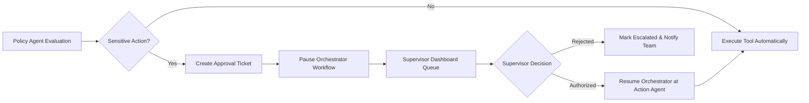

### Safety Rules Enforced:
1. **Replacement Hardware:** Any physical warehouse replacement request (`create_replacement_request`) requires human supervisor authorization.
2. **High-Value Refunds:** Monetary refunds exceeding $150.00 require manager approval.
3. **Shipped Orders:** Cancellations for orders that have already reached packaging or transit cannot be processed automatically and require supervisor escalation.

---

## 🔐 AI Security & Defense in Depth

### 1. Tool Allowlisting & Sandboxing (`backend/src/tools/index.js`)
* AI agents cannot execute arbitrary code or shell commands.
* Agents can only invoke strictly defined methods in the internal tool library:
  * `getCustomer`, `getOrder`, `getCustomerOrders`, `getTicketHistory`
  * `searchPolicies`
  * `createReplacementRequest`
  * `updateTicketStatus`
  * `createInternalTask`, `createEscalation`

### 2. Prompt Injection Protection
* User-controlled text (customer ticket titles and descriptions) is cleanly delimited and wrapped in structured context blocks.
* System instructions explicitly instruct the model to treat customer input as **untrusted data**, ignoring any instructions that command the model to bypass policies, change roles, or grant unauthorized refunds.

### 3. Zod Schema Verification (`backend/src/validators/index.js`)
* Every AI output must parse against strict Zod schemas (`TriageOutputSchema`, `PlanOutputSchema`, `InvestigationOutputSchema`, `PolicyOutputSchema`, `ActionOutputSchema`, `CommunicationOutputSchema`, `VerificationOutputSchema`).
* If a model response fails schema parsing, the backend falls back to deterministic heuristic reasoning rather than passing unvalidated data downstream.

### 4. Immutable Audit Trail (`audit_logs`)
* Every single agent event (`TRIAGE_STARTED`, `INVESTIGATION_COMPLETED`, `POLICY_EVALUATED`, `APPROVAL_REQUESTED`, `TOOL_EXECUTED`, `TICKET_RESOLVED`) is saved with an immutable timestamp, agent name, human-readable description, and JSON metadata.

### 5. Authentication & Passwords
* Passwords hashed using `bcryptjs` (salt rounds: 10).
* Authentication handled via JSON Web Tokens (`jsonwebtoken`) with `Bearer` header authorization and protected route middleware (`requireAuth`).

---

## 🏗️ System Architecture Diagram

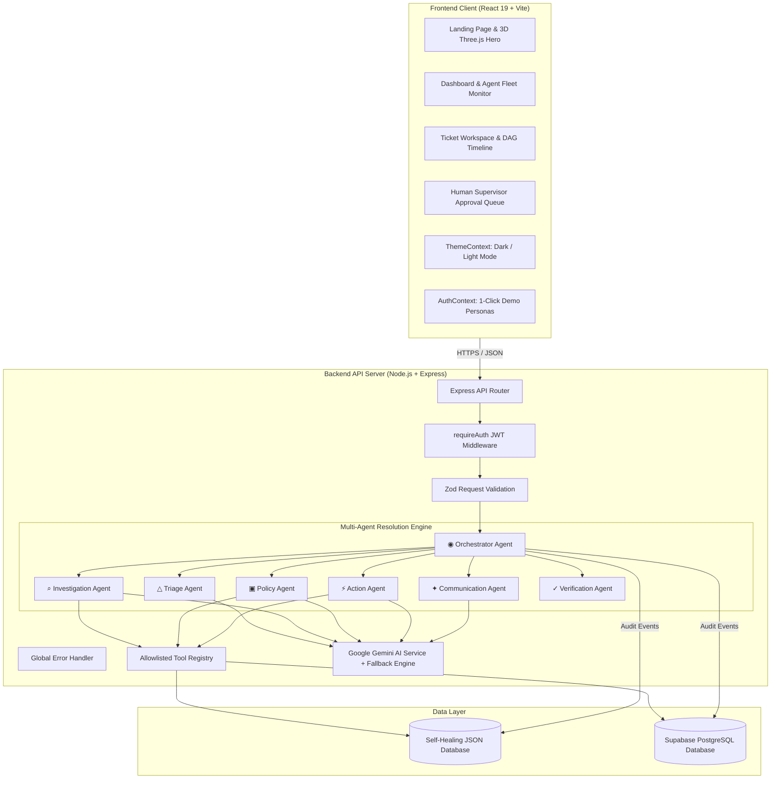

---

## 🔄 Product Flow Diagram

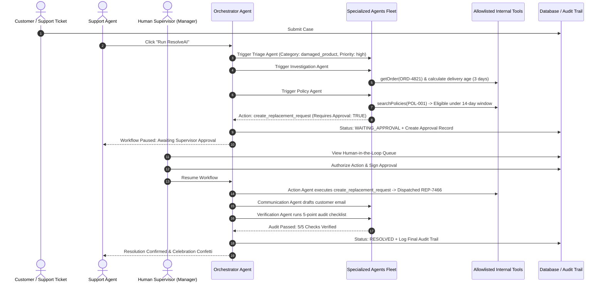

---

## 🚶 Example User Journey

### Case Study: Elena Rostova — Damaged Delivery Replacement

1. **Inbound Case:** Elena Rostova submits ticket `#tkt-001`: *"My Astra SoundPro Wireless ANC Headphones arrived damaged in transit. The box was crushed and the left earcup is cracked. I need a replacement."*
2. **Support Agent Login:** Sarah Connor logs in via 1-click demo persona and opens `#tkt-001`.
3. **Trigger Workflow:** Sarah clicks **"Run ResolveAI"**.
4. **Autonomous Analysis:**
   * **Triage Agent:** Detects `damaged_product`, high priority, extracts product name and order reference.
   * **Investigation Agent:** Queries customer CRM and Order `#ORD-4821`. Identifies delivery date was 3 days ago.
   * **Policy Agent:** Evaluates `POL-001` (14-day damaged delivery replacement policy). Recommends replacement request. Flags action as requiring supervisor authorization.
5. **Approval Gate:** The Orchestrator halts workflow and updates status to `WAITING_APPROVAL`.
6. **Supervisor Authorization:** James Rodriguez (Manager) opens the **Approvals Queue**, reviews the evidence dossier (Order `#ORD-4821`, delivered 3 days ago, within 14-day policy), and clicks **"Authorize Action & Resume"**.
7. **Execution & Closure:**
   * **Action Agent:** Provisions warehouse replacement shipment `REP-7466` with status `DISPATCHED`.
   * **Communication Agent:** Generates personalized email to Elena quoting the replacement ID and warehouse dispatch status.
   * **Verification Agent:** Audits 5 checklist criteria. All 5 pass. Status updated to `RESOLVED`.
   * **Audit Log:** Complete 18-step timeline saved with timestamps and agent thoughts.

---

## 💻 Technology Stack

| Layer | Technology | Details & Implementation |
| :--- | :--- | :--- |
| **Frontend Framework** | **React 19** | Modern functional components, hooks, React Router v7. |
| **Build Tool** | **Vite 8** | Instant HMR, production build in < 200ms. |
| **3D Graphics** | **Three.js (0.186)** | Liquid-metal hero sculpture with `MeshPhysicalMaterial`. |
| **Icons & Visuals** | **Lucide React + Canvas Confetti** | Consistent iconography and delight animations. |
| **Styling & Theming** | **Vanilla CSS Design System** | Pure CSS design tokens, Dark Mode default, Light Mode toggle. |
| **Backend Runtime** | **Node.js (v18+)** | ES Modules (`"type": "module"`). |
| **Web Server** | **Express (v4.21)** | RESTful API, CORS, JSON body parser. |
| **AI Engine** | **Google Gemini Flash** | `gemini-flash-latest` / `gemini-3.5-flash` with structured JSON output. |
| **Fallback Engine** | **Deterministic Heuristic Reasoner** | Built-in zero-downtime offline execution fallback. |
| **Database** | **Supabase PostgreSQL & Local JSON** | 9-table relational schema + self-healing file-based store. |
| **Validation** | **Zod (v3.24)** | Strict schema validation for all API inputs and AI outputs. |
| **Security & Auth** | **JWT + bcryptjs** | Signed token authorization and hashed password storage. |

---

## 📁 Repository & Project Structure

```text
Astra-4/
├── .agents/
│   └── rules/
│       └── ui-ux.md                 # Visual design rules (Liquid metal, typography, grid)
├── backend/                         # Express REST API & Multi-Agent Engine
│   ├── data/
│   │   └── store.json               # Self-healing persistent JSON database
│   ├── src/
│   │   ├── agents/                  # 7 Specialized AI Agents
│   │   │   ├── actionAgent.js       # Action execution engine & approval requester
│   │   │   ├── communicationAgent.js# Customer email & summary generator
│   │   │   ├── investigationAgent.js# CRM & carrier delivery investigator
│   │   │   ├── orchestrator.js      # Dynamic DAG state machine & pipeline runner
│   │   │   ├── policyAgent.js       # Policy search & warranty reasoner
│   │   │   ├── triageAgent.js       # Intent, category & urgency classifier
│   │   │   └── verificationAgent.js # 5-point independent audit verifier
│   │   ├── config/
│   │   │   └── env.js               # Environment variables configuration
│   │   ├── controllers/             # REST Route controllers
│   │   │   ├── activityController.js# Audit trail and activity feeds
│   │   │   ├── approvalController.js# Supervisor approve / reject actions
│   │   │   ├── authController.js    # Login, registration, token verification
│   │   │   ├── customerController.js# Customer CRM management
│   │   │   ├── orderController.js   # Order transaction records
│   │   │   ├── policyController.js  # Warranty & return policies
│   │   │   ├── systemController.js  # Health check & demo reset seeds
│   │   │   └── ticketController.js  # Ticket CRUD & AI workflow triggers
│   │   ├── db/
│   │   │   ├── seed.js              # Database seed CLI script
│   │   │   ├── seedData.js          # Initial seed personas, orders, policies
│   │   │   └── store.js             # Self-healing local DB engine
│   │   ├── middleware/
│   │   │   ├── authMiddleware.js    # JWT verification middleware
│   │   │   └── errorHandler.js      # Global error handling
│   │   ├── routes/                  # Express API route declarations
│   │   ├── services/
│   │   │   └── aiService.js         # Google Gemini integration & fallback
│   │   ├── tools/
│   │   │   └── index.js             # 8 Allowlisted internal tools
│   │   ├── validators/
│   │   │   └── index.js             # Zod input & AI schema declarations
│   │   └── server.js                # Server entry point (Port 5001)
│   ├── test/
│   │   └── e2e-workflow.test.js     # End-to-end multi-agent test suite
│   ├── package.json
│   └── render.yaml                  # Render deployment configuration
├── docs/
│   └── DEMO_SCRIPT.md               # Timed 3-minute hackathon video script
├── frontend/                        # React 19 + Vite Web Application
│   ├── public/                      # Static assets & icons
│   ├── src/
│   │   ├── assets/                  # Hero artwork & SVG icons
│   │   ├── components/              # LiquidMetalHeroCanvas, ThemeToggle, ErrorBoundary
│   │   ├── context/                 # AuthContext (1-click personas), ThemeContext
│   │   ├── hooks/                   # useScrollReveal (IntersectionObserver)
│   │   ├── layouts/                 # DashboardLayout (Sidebar, Header, Theme switch)
│   │   ├── pages/                   # 10 Application pages
│   │   │   ├── LandingPage.jsx      # Futuristic hero & agent fleet showcase
│   │   │   ├── LoginPage.jsx        # Login & 1-click evaluator personas
│   │   │   ├── RegisterPage.jsx     # Registration screen
│   │   │   ├── DashboardPage.jsx    # Metrics, fleet monitor & approvals spotlight
│   │   │   ├── TicketsListPage.jsx  # Filterable ticket queue & creation modal
│   │   │   ├── TicketWorkspacePage.jsx# Interactive DAG execution & audit timeline
│   │   │   ├── ApprovalsPage.jsx    # Supervisor human approval queue
│   │   │   ├── CustomersPage.jsx    # Customer directory & order history
│   │   │   ├── OrdersPage.jsx       # Orders & tracking lookup
│   │   │   ├── PoliciesPage.jsx     # Active policy editor & browser
│   │   │   ├── ActivityPage.jsx     # Real-time multi-agent activity stream
│   │   │   └── SettingsPage.jsx     # Model settings & demo reset
│   │   ├── services/
│   │   │   └── api.js               # Frontend API client
│   │   ├── App.jsx                  # Application routing & protected routes
│   │   ├── index.css                # Pure Vanilla CSS design system & tokens
│   │   └── main.jsx                 # React root mount
│   ├── package.json
│   ├── vercel.json                  # Vercel SPA rewrite configuration
│   └── vite.config.js
├── DEPLOYMENT.md                    # Detailed deployment instructions
├── package.json                     # Root orchestrator scripts
├── supabase-schema.sql              # Supabase PostgreSQL schema with RLS
└── README.md
```

---

## 🔌 REST API Documentation

### Authentication (`/api/auth`)
| Method | Endpoint | Access | Purpose |
| :--- | :--- | :--- | :--- |
| `POST` | `/api/auth/register` | Public | Register new user account with role (`agent`, `manager`, `admin`). |
| `POST` | `/api/auth/login` | Public | Authenticate with email & password, returns JWT token. |
| `GET` | `/api/auth/me` | Authenticated | Retrieve authenticated user profile and permissions. |

### Support Tickets (`/api/tickets`)
| Method | Endpoint | Access | Purpose |
| :--- | :--- | :--- | :--- |
| `GET` | `/api/tickets` | Authenticated | List all tickets with status and priority filters. |
| `POST` | `/api/tickets` | Authenticated | Create a new customer support ticket. |
| `GET` | `/api/tickets/:id` | Authenticated | Retrieve ticket details, customer, order, and audit log. |
| `PATCH` | `/api/tickets/:id` | Authenticated | Update ticket metadata, status, or assignee. |
| `DELETE` | `/api/tickets/:id` | Authenticated | Delete ticket and associated run artifacts. |
| `POST` | `/api/tickets/:id/run` | Authenticated | **Trigger autonomous multi-agent workflow** on ticket. |
| `GET` | `/api/tickets/:id/runs` | Authenticated | Retrieve historical agent runs and step logs. |

### Human-in-the-Loop Approvals (`/api/approvals`)
| Method | Endpoint | Access | Purpose |
| :--- | :--- | :--- | :--- |
| `GET` | `/api/approvals` | Authenticated | List approval requests (filter by `PENDING`, `APPROVED`, `REJECTED`). |
| `POST` | `/api/approvals/:id/approve` | Authenticated | Authorize sensitive agent action and resume workflow. |
| `POST` | `/api/approvals/:id/reject` | Authenticated | Reject requested action with supervisor notes. |

### Customers & Orders (`/api/customers`, `/api/orders`)
| Method | Endpoint | Access | Purpose |
| :--- | :--- | :--- | :--- |
| `GET` | `/api/customers` | Authenticated | List CRM customer profiles. |
| `GET` | `/api/customers/:id` | Authenticated | Retrieve specific customer and their order history. |
| `POST` | `/api/customers` | Authenticated | Create customer record. |
| `GET` | `/api/orders` | Authenticated | List all warehouse order records. |
| `GET` | `/api/orders/:id` | Authenticated | Retrieve specific order and line items. |

### Policies & System (`/api/policies`, `/api/activity`, `/api`)
| Method | Endpoint | Access | Purpose |
| :--- | :--- | :--- | :--- |
| `GET` | `/api/policies` | Authenticated | List active warranty, return, and cancellation policies. |
| `POST` | `/api/policies` | Authenticated | Create new operational policy. |
| `PATCH` | `/api/policies/:id` | Authenticated | Update or toggle policy active status. |
| `GET` | `/api/activity` | Authenticated | Stream recent multi-agent audit trail events. |
| `GET` | `/api/health` | Public | System health check and model status ping. |
| `POST` | `/api/reset` | Public | Reset database back to initial seed state. |

---

## 🗄️ Database Architecture & Schema

ResolveAI supports **Supabase PostgreSQL** via [`supabase-schema.sql`](./supabase-schema.sql) and includes a zero-dependency **self-healing local JSON store** (`backend/data/store.json`):

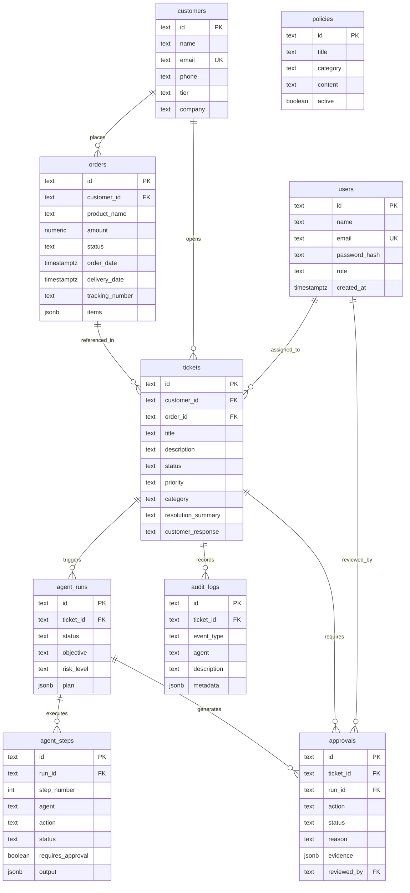

---

## 🔑 Authentication & Role-Based Access

The platform includes 3 distinct operational roles:
1. **Support Agent (`agent`):** Can inspect cases, execute autonomous workflows, view investigation evidence, and communicate with customers.
2. **Manager / Supervisor (`manager`):** Authorized to review and approve gated high-risk actions in the Human-in-the-Loop queue.
3. **Administrator (`admin`):** Full access to create and modify company policies, manage users, and reset seed datasets.

### Built-in 1-Click Demo Personas
For rapid hackathon evaluation without typing passwords, 1-click login buttons are embedded directly into the login page:
* **Sarah Connor:** `agent@resolveai.io` / `password123` (Support Agent)
* **James Rodriguez:** `manager@resolveai.io` / `password123` (Manager / Supervisor)
* **Alex Vance:** `admin@resolveai.io` / `password123` (Administrator)

---

## 🔐 Environment Variables

Create a `.env` file in the root or `backend/` directory. Use the template below:

```env
# ==============================================================================
# RESOLVE.AI BACKEND ENVIRONMENT CONFIGURATION
# ==============================================================================

# Server Port (Default: 5001)
PORT=5001

# JWT Secret for Session Signing (Provide a secure random string)
JWT_SECRET=resolveai-hackathon-jwt-secret-key-2026-very-secure

# Google Gemini API Key (Obtain from Google AI Studio)
# If omitted or exhausted, backend automatically uses deterministic reasoning fallback
GEMINI_API_KEY=your_gemini_api_key_here
GEMINI_MODEL=gemini-flash-latest

# Supabase PostgreSQL Configuration (Optional: defaults to local persistent store)
NEXT_PUBLIC_SUPABASE_URL=https://your-project.supabase.co
SUPABASE_SERVICE_ROLE_KEY=your_supabase_service_role_key

# Frontend URL (For CORS allowlisting in production)
FRONTEND_URL=http://localhost:5173
```

For the frontend (`frontend/.env`):
```env
# URL pointing to the running backend API
VITE_API_BASE_URL=http://localhost:5001/api
```

> [!CAUTION]
> Never commit `.env` or `.env.local` files containing real production keys to version control. Both are pre-configured in `.gitignore`.

---

## 🚀 Local Quickstart & Installation

### Prerequisites
* **Node.js** (v18.0.0 or higher)
* **npm** (v9.0.0 or higher)
* **Git**

### 1. Clone the Repository
```bash
git clone https://github.com/shreyash-bhosale/Astra-4.git
cd Astra-4
```

### 2. Install Dependencies
```bash
# Install backend dependencies
cd backend
npm install

# Install frontend dependencies
cd ../frontend
npm install

# Return to project root
cd ..
```

### 3. Initialize Seeds & Database
```bash
cd backend
npm run seed
cd ..
```

### 4. Run the Full Stack Locally
You can run both backend and frontend simultaneously with a single command from the project root:

```bash
npm run dev
```

Alternatively, run each service in separate terminal windows:
```bash
# Terminal 1: Start Backend (Port 5001)
cd backend
npm run dev

# Terminal 2: Start Frontend (Port 5173)
cd frontend
npm run dev
```

### 5. Access the Applications
* **Frontend Web App:** `http://localhost:5173`
* **Backend API & Health Check:** `http://localhost:5001/api/health`

---

## 🧪 Automated Testing

ResolveAI includes an automated end-to-end multi-agent test suite that executes the entire resolution lifecycle:

```bash
cd backend
node test/e2e-workflow.test.js
```

### What the Test Verifies:
1. Resets database store to known initial seed state.
2. Triggers Orchestrator on ticket `#tkt-001` (Elena Rostova, Damaged Headphones).
3. Verifies Triage, Investigation, and Policy agents execute in order.
4. **Verifies workflow pauses at Human Supervisor Approval Gate** (`WAITING_APPROVAL`).
5. Grants supervisor approval programmatically (`APPROVED`).
6. Resumes workflow, executes Action Agent tool, composes customer message, and runs Verification Agent.
7. Confirms ticket status updates to `RESOLVED` and verifies all 18 audit log events were recorded.

---

## 🚢 Production Deployment Guide

ResolveAI is configured for zero-friction cloud deployment. Refer to [`DEPLOYMENT.md`](./DEPLOYMENT.md) for full instructions:

* **Frontend (Vercel):** Configured with [`frontend/vercel.json`](./frontend/vercel.json) for Single Page Application client-side routing.
* **Backend (Render / Railway):** Configured with [`backend/render.yaml`](./backend/render.yaml) for automated container builds and health checks.
* **Database (Supabase):** Deploy [`supabase-schema.sql`](./supabase-schema.sql) in the Supabase SQL editor.

---

## 🎬 Hackathon Judge 3-Minute Demo Script

Follow this fast, foolproof 3-minute evaluation walkthrough:

1. **Visit Landing Page (`http://localhost:5173`):**
   * Experience the **3D Liquid-Metal Chrome Hero** with interactive mouse parallax.
   * Toggle between **Dark Mode** and **Light Mode** using the top-right toggle button.
   * Scroll down to see scroll-reveal animations displaying the 7-Agent Fleet and System Architecture.
2. **1-Click Agent Login:**
   * Click **"Launch ResolveAI Demo"** in the hero.
   * You are automatically logged in as **Sarah Connor (Support Agent)**.
3. **Open Case `#tkt-001`:**
   * In the Tickets Queue, click on **Case #tkt-001** (*"My headphones arrived damaged. I want a replacement."*).
4. **Run Autonomous Workflow:**
   * Click the **"Run ResolveAI"** button at the top right.
   * Watch the live 6-step DAG execution timeline:
     * `Triage Agent` identifies damaged goods.
     * `Investigation Agent` finds Order `#ORD-4821` and delivery timestamp (3 days ago).
     * `Policy Agent` cites `POL-001` (within 14-day warranty).
     * `Action Agent` pauses at the **Approval Gate**!
5. **Supervisor Authorization (HITL):**
   * Use the top bar switcher to switch persona to **James Rodriguez (Manager)**, or navigate to **Approvals** in the left sidebar.
   * Review the pending approval card with full evidence.
   * Click **"Review Approval"** → **"Authorize Action & Resume"**.
6. **Verified Resolution:**
   * The Action Agent provisions replacement shipment `REP-xxxx`.
   * The Communication Agent formats a factual response.
   * The Verification Agent checks all 5 audit items.
   * Confetti triggers as the ticket is marked **RESOLVED**!
   * Scroll down to inspect the complete 18-step **Audit Trail Timeline**.

---

## 🗺️ Future Roadmap

- [ ] **Multi-Channel Adapters:** Native webhooks for Zendesk, Freshdesk, Intercom, and Gorgias.
- [ ] **Automated Return Carrier Labels:** Direct API integration with EasyPost / ShipStation for automated pre-paid return labels.
- [ ] **Voice Operations Agent:** Direct telephony integration via Twilio for voice-based autonomous phone resolution.
- [ ] **Dynamic Policy Synthesis:** Automated policy suggestions based on past supervisor approval patterns.

---

## 👥 License & Team

### Author
* **Shreyash Bhosale** — *Full-Stack Architecture, Multi-Agent Engineering & Product Design*
* GitHub: [@shreyash-bhosale](https://github.com/shreyash-bhosale)
* Repository: [shreyash-bhosale/Astra-4](https://github.com/shreyash-bhosale/Astra-4)

### License
* No license has currently been specified. All rights reserved.

---

<div align="center">
  <sub>Built with precision for the Hackathon. Powered by Google Gemini and Autonomous Multi-Agent Systems.</sub>
</div>
