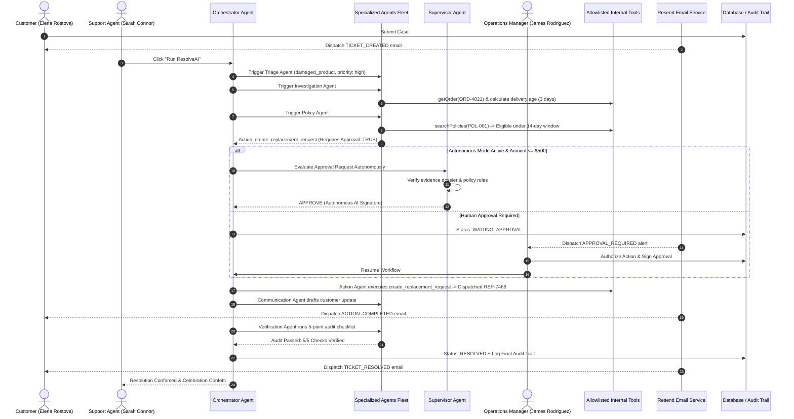

<div align="center">

# ⚡ RESOLVE.AI

### Autonomous Agentic Customer-Operations Platform
**From customer issue to verified resolution — autonomously.**

<p align="center">
  <em>Theme: Agentic AI & Intelligent Systems &nbsp;|&nbsp; Hackathon Submission</em>
</p>

<p align="center">
  <a href="https://astra4-delta.vercel.app/">
    
  </a>
  <a href="https://github.com/shreyash-bhosale/Astra-4">
    
  </a>
  <a href="./docs/screenshots/resolveai-demo-walkthrough.gif">
    
  </a>
</p>

<p align="center">
  
</p>

<p align="center">
  
  
  
  
  
  
  
  
  
</p>

</div>

---

## 📑 Table of Contents

1. [What is ResolveAI?](#-what-is-resolveai)
2. [Problem Statement & Enterprise Value](#-problem-statement--enterprise-value)
3. [The Solution: Autonomous Multi-Agent Operations](#-the-solution-autonomous-multi-agent-operations)
4. [Live Demo & Video Walkthrough](#-live-demo--video-walkthrough)
5. [User Interface & Screenshots Gallery](#-user-interface--screenshots-gallery)
6. [Key Features](#-key-features)
7. [The 8-Agent Supervisory Topology](#-the-8-agent-supervisory-topology)
8. [Autonomous AI Mode & Governance Control Plane](#-autonomous-ai-mode--governance-control-plane)
9. [Automated Transactional Email System (Resend)](#-automated-transactional-email-system-resend)
10. [Customer Care Portal](#-customer-care-portal)
11. [End-to-End Workflow & State Machine](#-end-to-end-workflow--state-machine)
12. [Human-in-the-Loop (HITL) Safety Gate](#-human-in-the-loop-hitl-safety-gate)
13. [AI Security & Defense-in-Depth](#-ai-security--defense-in-depth)
14. [Example User Journey](#-example-user-journey)
15. [Technology Stack](#-technology-stack)
16. [Repository & Project Structure](#-repository--project-structure)
17. [REST API Documentation](#-rest-api-documentation)
18. [Database Architecture & Schema](#-database-architecture--schema)
19. [Authentication & Role-Based Access (RBAC)](#-authentication--role-based-access-rbac)
20. [Environment Variables](#-environment-variables)
21. [Local Quickstart & Installation](#-local-quickstart--installation)
22. [Automated Testing & Audit Verification](#-automated-testing--audit-verification)
23. [Production Deployment Guide](#-production-deployment-guide)
24. [Hackathon Judge 3-Minute Demo Script](#-hackathon-judge-3-minute-demo-script)
25. [License & Team](#-license--team)

---

## 💡 What is ResolveAI?

**ResolveAI** is an enterprise-grade **agentic customer-operations platform** that autonomously investigates customer support tickets, plans multi-step resolution paths, queries internal enterprise databases, reasons against company warranty and return policies, coordinates specialized AI agents, and enforces strict **policy-governed authorization gates** before executing real operations.

Unlike conversational chatbots that merely generate polite text without operational capabilities, ResolveAI operates as a **secure, auditable, autonomous operations engine**:
* **Investigates** CRM customer records, purchase histories, and real-time carrier tracking timestamps.
* **Evaluates** company legal policies, return rules, and warranty coverage windows deterministically.
* **Provisions** real warehouse replacement dispatches and ERP status updates through gated tools.
* **Automates** transactional customer emails and managerial alerts via **Resend** with smart sandbox fallbacks.
* **Audits** every resolution with an independent 5-point verification gate before any ticket can be marked resolved.
* **Governs** operations via the **ResolveAI Supervisor Agent** with configurable autonomous financial thresholds ($250 to unlimited) and immediate emergency stop controls.
* **Logs** an immutable, timestamped audit trail of every agent thought, tool execution, and supervisor signature.

---

## 🎯 Problem Statement & Enterprise Value

### The Real-World Pain
Modern customer operations teams at e-commerce, hardware, and SaaS companies suffer from severe friction:
1. **Fragmented Data Silos:** Support representatives waste 70% of case handling time toggling between ticket queues (Zendesk), CRM customer profiles (Salesforce), order management systems (Shopify/ERP), carrier tracking portals (FedEx/UPS), and internal policy wikis.
2. **Repetitive Calculation Fatigue:** Agents manually compute whether a damaged item arrived within a 14-day warranty policy window or verify whether an order is eligible for pre-dispatch cancellation.
3. **The "Black-Box" Bot Risk:** Conventional LLM chatbots frequently hallucinate false promises to customers (e.g., promising full refunds outside policy) or lack the programmatic safety controls required to execute internal tools without runaway financial or inventory risk.
4. **Zero Auditability:** Standard support software fails to capture a transparent chain of reasoning showing *why* a replacement was approved, *which* policy clause applied, and *who* verified the evidence.

### The ResolveAI Value
* **Autonomous Resolution in Seconds:** Resolves routine warranty claims, defective product replacements, wrong shipments, and pre-dispatch cancellations in under 5 seconds rather than 24–48 hours.
* **Deterministic Policy Enforcement:** Eliminates human error and policy violations by programmatically evaluating policy clauses against verifiable timestamps and database records.
* **Guaranteed Financial & Operational Safety:** Sensitive operations (replacements, large refunds) are physically halted at a supervisor approval gate until authorized, or handled autonomously only within administrator-configured monetary limits.
* **Automated Customer Communication:** Dispatches professional, fact-checked transactional emails automatically on every ticket state transition without requiring manual drafting.
* **Complete Explainability:** An immutable 18-point audit log records every single agent thought, tool call parameter, policy citation, and human/supervisor decision.

---

## 🛠️ The Solution: Autonomous Multi-Agent Operations

ResolveAI organizes intelligence into a **two-tier supervisory multi-agent architecture**: an **8th Supervisory Intelligence Layer** that oversees, governs, and coordinates a **7-Agent Autonomous Execution Fleet**:

```text
                             ┌───────────────────────────────────────┐
                             │       RESOLVEAI SUPERVISOR AGENT       │
                             │       (AI Control Center Layer)       │
                             │  • Autonomous Approval Evaluation     │
                             │  • Financial Threshold Enforcement    │
                             │  • Pause & Emergency Stop Control     │
                             │  • Operational Intelligence Telemetry │
                             └──────────────────┬────────────────────┘
                                                │ Supervises & Governs
                                                ▼
                             ┌───────────────────────────────────────┐
                             │         ORCHESTRATOR AGENT            │
                             │  • Formulates 6-Step Dynamic DAG Plan │
                             │  • Enforces Step Dependencies         │
                             └───────┬──────────────────────┬────────┘
                                     │                      │
                   ┌─────────────────┴─────┐          ┌─────┴─────────────────┐
                   ▼                       ▼          ▼                       ▼
            [ △ TRIAGE AGENT ]     [ ⌕ INVESTIGATION ] [ ▣ POLICY AGENT ]   [ ⚡ ACTION AGENT ]
            Classifies Intent,     Queries CRM, Orders Evaluates Active     Executes Gated Tools
            Urgency & Entities     & Delivery Age      Company Rules        (Warehouse Dispatch)
                   │                       │                  │                       │
                   └───────────────────────┼──────────────────┘                       │
                                           ▼                                          │
                               ┌───────────────────────┐                              │
                               │  APPROVAL EVALUATION  │                              │
                               │  • Autonomous AI Gate ├──────────────────────────────┘
                               │  • Human Manager Gate │
                               └───────────┬───────────┘
                                           │
                        ┌──────────────────┴──────────────────┐
                        ▼                                     ▼
            [ ✦ COMMUNICATION AGENT ]               [ ✓ VERIFICATION AGENT ]
            Composes Factual Customer Updates       Independent 5-Point Audit
            & Triggers Transactional Emails         Checklist Before Closure
                        │                                     │
                        └──────────────────┬──────────────────┘
                                           ▼
                             [ ✅ CASE VERIFIED & RESOLVED ]
                             + Immutable Audit Trail & Metrics
```

---

## 🎥 Live Demo & Video Walkthrough

| Resource | Link | Description |
| :--- | :--- | :--- |
| **Demo Walkthrough Video** | [`[▶️ Watch Animated Video Walkthrough]`](./docs/screenshots/resolveai-demo-walkthrough.gif) | Animated resolution walkthrough: multi-agent DAG execution, approval gating, and autonomous resolution. |
| **Live Web App** | [`https://astra4-delta.vercel.app/`](https://astra4-delta.vercel.app/) | Production web application with Dark/Light mode, interactive 3D hero, and full staff + customer portal. |
| **GitHub Repository** | [`https://github.com/shreyash-bhosale/Astra-4`](https://github.com/shreyash-bhosale/Astra-4) | Complete full-stack codebase with frontend, backend, test suites, and schema. |

---

## 🖼️ User Interface & Screenshots Gallery

ResolveAI features a **futuristic liquid-metal aesthetic**, contemporary grotesk typography, high-contrast dark mode (default) and light mode, and responsive 12-column layouts.

### 1. Futuristic Liquid-Metal Landing Page Hero (Dark & Light Mode)
<p align="center">
  
  
</p>

### 2. Multi-Agent Fleet Showcase & Polished Status Monitor
<p align="center">
  
</p>

### 3. Operations Dashboard & Real-Time Fleet Health
<p align="center">
  
</p>

### 4. Interactive 6-Step DAG Execution Workspace & Human-in-the-Loop Gate
<p align="center">
  
  
</p>

### 5. Verified Case Resolution with Immutable Audit Trail
<p align="center">
  
</p>

### 6. Rapid Evaluation Login Screen with 1-Click Demo Personas
<p align="center">
  
</p>

---

## 🌟 Key Features

### 1. 3D Liquid-Metal Hero Experience
* Developed in pure **Three.js** using `MeshPhysicalMaterial` (`roughness: 0.08`, `metalness: 0.98`, `clearcoat: 1.0`).
* Procedurally generates organic liquid chrome ribbon sculptures and mercury droplets.
* Studio lighting dynamically recalibrates when toggling between Dark Mode (obsidian specular highlights) and Light Mode (bright studio chrome).
* Features pointer-driven micro-parallax and respects `@media (prefers-reduced-motion: reduce)`.

### 2. Autonomous Multi-Agent Resolution Engine
* Coordinates 8 specialized agents via a dynamic Directed Acyclic Graph (DAG) state machine.
* Connects to **Google Gemini Flash** (`gemini-flash-latest` / `gemini-3.5-flash`) with structured JSON schema outputs.
* **Deterministic Fallback Engine:** Features built-in heuristic reasoning fallbacks that guarantee instantaneous zero-downtime execution even during Google AI Studio rate limits (429) or temporary outages.

### 3. AI Control Center & Autonomous AI Mode
* Configurable **Autonomy Modes**: `Full Autonomous`, `Semi-Autonomous / Gated`, `Paused`, and `Emergency Stop`.
* **Dynamic Financial Thresholds**: $250, $500, $1,000, $2,500, or Unlimited. Requests below the threshold are evaluated and approved autonomously by the Supervisor Agent; requests exceeding the limit are automatically escalated to human managers.
* **Live Supervisor Operational Assistant**: Natural-language chat grounded in real-time ticket state, orders, agent runs, and fleet health.

### 4. Automated Transactional Email System (Resend)
* Sends branded transactional emails on every key lifecycle event directly from the backend.
* Zero configuration needed for customers or managers.
* Includes intelligent **Resend Sandbox routing** to deliver live emails directly to the account owner's verified inbox (`shreyashbiit1508@gmail.com`) when using `onboarding@resend.dev`.

### 5. Full Customer Care Portal
* Dedicated consumer experience for end-users to raise issues, link orders, check real-time progress, and converse with an AI Support Assistant.
* Includes confetti celebration on ticket submission, active warranty badges, and visibility-aware polling.

### 6. Independent 5-Point Verification Audit
* Before closing any ticket, the Verification Agent audits:
  1. Have all planned DAG steps completed?
  2. Is the customer and order evidence dossier complete?
  3. Does the solution strictly adhere to company policy?
  4. Was required supervisor approval obtained and logged?
  5. Was the customer informed with accurate context?

### 7. Dual Theme System (Dark Mode Default)
* Built on pure CSS custom properties (`--bg-primary: #09090b`, `--text-primary: #f4f4f7`).
* Includes one-click `ThemeToggle` across the landing page, login, register, dashboard, and customer portal.

---

## 🧠 The 8-Agent Supervisory Topology

ResolveAI avoids the unreliability of monolithic single-prompt LLMs by adopting a **specialized, decoupled multi-agent topology**:

| Agent | Icon | Role & Responsibility | Internal Tools Used | Zod Output Schema |
| :--- | :---: | :--- | :--- | :--- |
| **Supervisor Agent** | `⚡` | Supervises the complete fleet, evaluates approval requests autonomously, enforces financial limits, provides conversational operational telemetry, and halts rogue execution. | Fleet Telemetry, Control Plane, Policy Audit | `SupervisorDecisionSchema` |
| **Orchestrator Agent** | `◉` | Formulates 6-step DAG plan, manages execution transitions, enforces dependencies, handles pause/resume. | DAG State Machine | `PlanOutputSchema` |
| **Triage Agent** | `△` | Analyzes ticket title/description, extracts entities (order IDs, product names), classifies intent & urgency. | Semantic Classifier | `TriageOutputSchema` |
| **Investigation Agent** | `⌕` | Queries CRM databases, retrieves transaction records, computes carrier delivery age against warranty window. | `getCustomer()`, `getOrder()`, `getCustomerOrders()`, `getTicketHistory()` | `InvestigationOutputSchema` |
| **Policy Agent** | `▣` | Searches active policy database, evaluates warranty rules against evidence, flags required approvals. | `searchPolicies()` | `PolicyOutputSchema` |
| **Action Agent** | `⚡` | Executes allowlisted internal tools. Pauses at approval gate on sensitive operations. | `createReplacementRequest()`, `updateTicketStatus()`, `createInternalTask()`, `createEscalation()` | `ActionOutputSchema` |
| **Communication Agent** | `✦` | Drafts personalized customer resolution emails and internal briefings strictly grounded in verified facts. | Contextual Formatter | `CommunicationOutputSchema` |
| **Verification Agent** | `✓` | Independent auditor running a 5-point verification checklist before authorizing final ticket closure. | Audit Validator | `VerificationOutputSchema` |

---

## 🛡️ Autonomous AI Mode & Governance Control Plane

The **ResolveAI Supervisor Agent** introduces policy-governed autonomy:

```text
Policy Agent
     │
     ▼
Approval Request
     │
     ▼
Supervisor Agent
     │
     ├── In "Full Autonomous" mode AND value <= threshold ($500)?
     │   ├── YES -> Evaluates evidence & policy compliance autonomously.
     │   │          Signs approval as "AI Supervisor (Autonomous)".
     │   │          Hands off to Action Agent for immediate execution.
     │   │
     │   └── NO  -> Escalates to Human Manager Approval Queue.
     │              Awaits human signature before Action Agent runs.
```

### Governance Capabilities:
1. **Financial Threshold Guardrails:** Administrators set exact spending boundaries ($250, $500, $1000, $2500, Unlimited).
2. **Instant Pause Directive:** Halts new AI workflow launches across the platform with one click.
3. **Emergency Stop (Killswitch):** Actively halts in-flight agent runs, blocks pending tool executions, and logs security audit records.
4. **Natural-Language Operational Telemetry:** Query the Supervisor about specific tickets (`"What is the status of TKT-001?"`), fleet load, or policy compliance.

---

## 📧 Automated Transactional Email System (Resend)

ResolveAI provides backend-driven transactional email dispatch powered by **Resend**:

### Supported Transactional Events:
1. `TICKET_CREATED`: Sent when a customer submits a new ticket.
2. `TICKET_STATUS_UPDATED`: Sent when an agent or workflow advances ticket progress.
3. `APPROVAL_REQUIRED`: Dispatched to operations managers when a sensitive action requires human authorization.
4. `ACTION_COMPLETED`: Sent when warehouse replacement is provisioned.
5. `TICKET_RESOLVED`: Comprehensive resolution report with replacement tracking numbers.
6. `ADMIN_TEST`: Verification test dispatch triggered from the Admin Settings console.

### Resend Sandbox Compatibility:
When running with an unverified free domain (`onboarding@resend.dev`), Resend restricts outbound emails to the account owner's email (`shreyashbiit1508@gmail.com`). ResolveAI includes **automatic sandbox fallback routing**:
- If an email is intended for a customer (e.g. `elena.rostova@example.com`), the backend catches the sandbox constraint and **safely routes the rendered email directly to your verified inbox (`shreyashbiit1508@gmail.com`)**, prepending an informative notification badge.
- As soon as a custom domain is verified in Resend, emails seamlessly deliver directly to external recipients.

---

## 👥 Customer Care Portal

The dedicated customer portal (`/customer`) provides end-users with transparency into the resolution process:

* **Customer Home (`/customer`):** High-level summary of active tickets, resolved issues, customer account tier, and quick actions.
* **Raise an Issue (`/customer/issues/new`):** Clean submission flow with order selection, issue category picker, description textarea, and celebratory confetti upon completion.
* **Issue Tracking (`/customer/issues/:id`):** Real-time visibility-aware progress tracker with step-by-step resolution status.
* **Order History (`/customer/orders`):** View past purchases, order amounts, and one-click "Report Problem" buttons.
* **AI Support Assistant (`/customer/support`):** Real-time conversational agent grounded in the customer's orders and company policies.
* **Profile & Notification Settings (`/customer/profile`):** Manage email delivery preferences (opt-in / opt-out).

---

## 🔄 End-to-End Workflow & State Machine



---

## 🔒 AI Security & Defense-in-Depth

| Security Domain | Defense Mechanism | Implementation |
| :--- | :--- | :--- |
| **Prompt Injection Protection** | Strict separation of instructions and data | Customer text is placed in isolated data blocks; strict system prompts instruct models to ignore instructions embedded in user input. |
| **Output Hallucination Prevention** | Factual grounding & Zod schema validation | Every LLM response is strictly parsed and validated against Zod schemas; invalid payloads fail safely. |
| **Privilege Escalation Prevention** | Strict RBAC & customer data isolation | Customers are prevented from viewing or modifying tickets belonging to other customer accounts (`403 Forbidden`). |
| **Unauthorized Action Execution** | Tool allowlisting & approval gates | Agents can only invoke predefined tools; physical actions require human manager or Supervisor authorization. |
| **Email Injection Prevention** | CRLF sanitization & regex validation | Header values are sanitized against multi-line injection attacks (`\r`, `\n`); idempotency keys prevent duplicate dispatches. |
| **System Denial of Service** | Rate limiters & Execution control plane | Express rate limiters protect API routes; administrators can pause operations or trigger emergency stops instantly. |

---

## 🚶 Example User Journey

### Case Study: Elena Rostova — Damaged Delivery Replacement

1. **Inbound Case:** Elena Rostova submits ticket `#tkt-001` via the Customer Portal: *"My Astra SoundPro Wireless ANC Headphones arrived damaged in transit. The box was crushed and the left earcup is cracked. I need a replacement."*
2. **Support Agent Login:** Sarah Connor logs in via 1-click demo persona and opens `#tkt-001`.
3. **Trigger Workflow:** Sarah clicks **"Run ResolveAI"**.
4. **Autonomous Analysis:**
   * **Triage Agent:** Detects `damaged_product`, high priority, extracts product name and order reference.
   * **Investigation Agent:** Queries customer CRM and Order `#ORD-4821`. Identifies delivery date was 3 days ago.
   * **Policy Agent:** Evaluates `POL-001` (14-day damaged delivery replacement policy). Recommends replacement request. Flags action as requiring authorization.
5. **Approval Evaluation:**
   * If **Autonomous AI Mode** is active ($349 < $500 threshold), the **Supervisor Agent** evaluates the evidence and policy compliance, approving the replacement autonomously.
   * If in **Gated Mode**, the workflow pauses and alerts James Rodriguez (Manager) in the Approvals Queue.
6. **Execution & Closure:**
   * **Action Agent:** Provisions warehouse replacement shipment `REP-7466` with status `DISPATCHED`.
   * **Communication Agent:** Generates personalized email to Elena quoting the replacement ID and warehouse dispatch status.
   * **Email Dispatch:** Resend delivers the update email to Elena (or verified developer email in sandbox mode).
   * **Verification Agent:** Audits 5 checklist criteria. All 5 pass. Status updated to `RESOLVED`.
   * **Audit Log:** Complete 18-step timeline saved with timestamps and agent thoughts.

---

## 💻 Technology Stack

| Layer | Technology | Details & Implementation |
| :--- | :--- | :--- |
| **Frontend Framework** | **React 19** | Modern functional components, hooks, React Router v7. |
| **Build Tool** | **Vite 8** | Instant HMR, production build in < 250ms. |
| **3D Graphics** | **Three.js (0.186)** | Liquid-metal hero sculpture with `MeshPhysicalMaterial`. |
| **Icons & Visuals** | **Lucide React + Canvas Confetti** | Iconography and delight micro-animations. |
| **Styling & Theming** | **Vanilla CSS Design System** | Pure CSS design tokens, Dark Mode default, Light Mode toggle. |
| **Backend Runtime** | **Node.js (v18+)** | Modern ES Modules (`"type": "module"`). |
| **Web Server** | **Express (v4.21)** | RESTful API, CORS, JSON body parser, rate limiters. |
| **AI Engine** | **Google Gemini Flash** | `gemini-flash-latest` / `gemini-3.5-flash` with structured JSON output. |
| **Fallback Engine** | **Deterministic Heuristic Reasoner** | Built-in zero-downtime offline execution fallback. |
| **Email Provider** | **Resend (v6.31)** | Transactional email provider with sandbox routing. |
| **Database** | **Supabase PostgreSQL & Local JSON** | 9-table relational schema + self-healing file-based store. |
| **Validation** | **Zod (v3.24)** | Strict schema validation for all API inputs and AI outputs. |
| **Security & Auth** | **JWT + bcryptjs** | Signed token authorization and hashed password storage. |

---

## 📁 Repository & Project Structure

```text
Astra-4/
├── .agents/
│   └── rules/
│       └── ui-ux.md                 # Design rules (Liquid metal, typography, grid)
├── backend/                         # Express REST API & Multi-Agent Engine
│   ├── data/
│   │   └── store.json               # Self-healing persistent JSON database
│   ├── src/
│   │   ├── agents/                  # 8 Specialized AI Agents
│   │   │   ├── supervisorAgent.js   # Supervisory AI, autonomous approvals, control plane
│   │   │   ├── actionAgent.js       # Action execution engine & approval requester
│   │   │   ├── communicationAgent.js# Customer email & summary generator
│   │   │   ├── investigationAgent.js# CRM & carrier delivery investigator
│   │   │   ├── orchestrator.js      # Dynamic DAG state machine & pipeline runner
│   │   │   ├── policyAgent.js       # Policy search & warranty reasoner
│   │   │   ├── triageAgent.js       # Intent, category & urgency classifier
│   │   │   └── verificationAgent.js # 5-point independent audit verifier
│   │   ├── config/
│   │   │   └── env.js               # Environment variables configuration
│   │   ├── controllers/             # REST Route controllers
│   │   │   ├── activityController.js# Audit trail and activity feeds
│   │   │   ├── approvalController.js# Supervisor approve / reject actions
│   │   │   ├── authController.js    # Login, registration, token verification
│   │   │   ├── customerController.js# Customer CRM management
│   │   │   ├── customerPortalController.js # Customer portal endpoints
│   │   │   ├── emailController.js   # Email status, logs, and test dispatch
│   │   │   ├── orderController.js   # Order transaction records
│   │   │   ├── policyController.js  # Warranty & return policies
│   │   │   ├── supervisorController.js # Supervisor telemetry & control
│   │   │   ├── systemController.js  # Health check & demo reset seeds
│   │   │   └── ticketController.js  # Ticket CRUD & AI workflow triggers
│   │   ├── db/
│   │   │   ├── seed.js              # Database seed CLI script
│   │   │   ├── seedData.js          # Initial seed personas, orders, policies
│   │   │   └── store.js             # Supabase & self-healing local DB engine
│   │   ├── middleware/
│   │   │   ├── authMiddleware.js    # JWT verification & RBAC
│   │   │   ├── errorHandler.js      # Global error handling
│   │   │   └── rateLimiter.js       # Express rate limiting
│   │   ├── routes/                  # Express API route declarations
│   │   ├── services/
│   │   │   ├── aiService.js         # Google Gemini integration & fallback
│   │   │   ├── emailService.js      # Resend email dispatcher with sandbox routing
│   │   │   └── emailTemplates.js    # HTML/text transactional email templates
│   │   ├── tools/
│   │   │   └── index.js             # Allowlisted internal tools
│   │   ├── validators/
│   │   │   └── index.js             # Zod input & AI schema declarations
│   │   └── server.js                # Server entry point (Port 5001)
│   ├── test-email-automation.js     # 36-assertion email test suite
│   ├── test-full-system-audit.js    # 23-assertion full system test suite
│   ├── test-supervisor-autonomy.js  # Supervisor autonomy test suite
│   ├── package.json
│   └── render.yaml                  # Render deployment configuration
├── frontend/                        # React 19 + Vite Web Application
│   ├── public/                      # Static assets & icons
│   ├── src/
│   │   ├── assets/                  # Hero artwork & SVG icons
│   │   ├── components/              # LiquidMetalHeroCanvas, ThemeToggle, ErrorBoundary
│   │   ├── context/                 # AuthContext (1-click personas), ThemeContext
│   │   ├── hooks/                   # useScrollReveal (IntersectionObserver)
│   │   ├── layouts/                 # DashboardLayout, CustomerLayout
│   │   ├── pages/                   # Application pages
│   │   │   ├── LandingPage.jsx      # Futuristic hero & agent fleet showcase
│   │   │   ├── LoginPage.jsx        # Login & 1-click evaluator personas
│   │   │   ├── RegisterPage.jsx     # Registration screen
│   │   │   ├── DashboardPage.jsx    # Metrics, fleet monitor & approvals spotlight
│   │   │   ├── TicketsListPage.jsx  # Filterable ticket queue & creation modal
│   │   │   ├── TicketWorkspacePage.jsx # Interactive DAG execution & audit timeline
│   │   │   ├── ApprovalsPage.jsx    # Supervisor human approval queue
│   │   │   ├── CustomersPage.jsx    # Customer directory & order history
│   │   │   ├── OrdersPage.jsx       # Orders & tracking lookup
│   │   │   ├── PoliciesPage.jsx     # Active policy editor & browser
│   │   │   ├── ActivityPage.jsx     # Real-time multi-agent activity stream
│   │   │   ├── AIControlCenterPage.jsx # AI Control Center & Supervisor settings
│   │   │   ├── SettingsPage.jsx     # Model settings, email tests & demo reset
│   │   │   └── customer/            # Customer Care Portal pages
│   │   │       ├── CustomerHomePage.jsx     # Customer dashboard
│   │   │       ├── CustomerIssuesPage.jsx   # Customer ticket list
│   │   │       ├── CustomerIssueDetailPage.jsx # Real-time tracking
│   │   │       ├── RaiseIssuePage.jsx       # Issue submission with order link
│   │   │       ├── CustomerOrdersPage.jsx   # Order history
│   │   │       ├── CustomerAISupportPage.jsx# AI Support chat
│   │   │       └── CustomerProfilePage.jsx  # Notification preferences
│   │   ├── services/
│   │   │   ├── api.js               # Frontend API client
│   │   │   └── clientMockStore.js   # Offline high-fidelity mock store
│   │   ├── App.jsx                  # Application routing & protected routes
│   │   ├── index.css                # Pure Vanilla CSS design system & tokens
│   │   └── main.jsx                 # React root mount
│   ├── package.json
│   ├── vercel.json                  # Vercel SPA rewrite configuration
│   └── vite.config.js
├── DEPLOYMENT.md                    # Detailed deployment instructions
├── supabase-schema.sql              # Supabase PostgreSQL schema with RLS
└── package.json                     # Root orchestrator scripts
```

---

## 🔌 REST API Documentation

### Authentication & Users
* `POST /api/auth/login` — Authenticate user and receive signed JWT.
* `POST /api/auth/register` — Register a new account.
* `GET /api/auth/me` — Retrieve current authenticated user profile.

### Tickets & AI Multi-Agent Workflow
* `GET /api/tickets` — List tickets with optional status and priority filters.
* `POST /api/tickets` — Create a new customer support ticket.
* `GET /api/tickets/:id` — Retrieve ticket details, active run, and audit logs.
* `POST /api/tickets/:id/run` — Launch autonomous 8-agent resolution workflow.
* `POST /api/tickets/:id/notes` — Append internal team notes to ticket.

### AI Control Center & Supervisor Agent
* `GET /api/supervisor/status` — Operational status, fleet load, and autonomy mode.
* `POST /api/supervisor/settings` — Update autonomy mode and financial threshold.
* `POST /api/supervisor/chat` — Interactive natural-language queries to Supervisor.
* `POST /api/supervisor/emergency-stop` — Trigger emergency halt of active runs.

### Approvals
* `GET /api/approvals` — List pending, approved, and rejected authorization requests.
* `POST /api/approvals/:id/approve` — Authorize action and resume workflow.
* `POST /api/approvals/:id/reject` — Reject action with supervisor reviewer notes.

### Transactional Emails
* `GET /api/emails/status` — Operational status of email subsystem.
* `POST /api/emails/test` — Protected admin test email dispatch.
* `GET /api/emails/logs` — Outbound transactional email audit log.

### Customer Portal
* `GET /api/customer/profile` — Authenticated customer profile and order stats.
* `GET /api/customer/tickets` — Issues submitted by the authenticated customer.
* `POST /api/customer/tickets` — Raise a new customer support issue.
* `GET /api/customer/orders` — Order history for the authenticated customer.
* `GET /api/customer/notifications` — Notification drawer items.
* `POST /api/customer/chat` — Conversational AI Support Assistant.

---

## 🗄️ Database Architecture & Schema

ResolveAI supports **Supabase PostgreSQL** and a **self-healing local store**:

1. **`users`**: User accounts, hashed passwords, roles (`admin`, `manager`, `agent`, `customer`).
2. **`customers`**: CRM directory, verified email addresses, tier status (`VIP Enterprise`, `Standard`).
3. **`orders`**: Transaction records, tracking numbers, items, purchase and delivery timestamps.
4. **`policies`**: Active company policies (`POL-001`, `POL-002`, etc.) with eligibility clauses.
5. **`tickets`**: Support cases with priority, status (`OPEN`, `INVESTIGATING`, `WAITING_APPROVAL`, `RESOLVED`).
6. **`agent_runs`**: Execution runs storing the dynamic DAG plan, active step, and verification results.
7. **`approvals`**: Authorization requests with financial risk levels, supervisor decisions, and reviewer notes.
8. **`email_notifications`**: Outbound email logs, delivery IDs, status (`SENT`, `QUEUED`, `FAILED`).
9. **`audit_logs`**: Immutable 18-point audit trail recording every agent action, tool invocation, and decision.

---

## 👤 Authentication & Role-Based Access (RBAC)

ResolveAI provides pre-seeded **1-click evaluation personas** on the login screen:

| Persona | Role | Email | Password | Access Permissions |
| :--- | :--- | :--- | :--- | :--- |
| **Sarah Connor** | `agent` | `sarah.connor@resolveai.io` | `password123` | Ticket Workspace, Trigger AI Runs, View Activity |
| **James Rodriguez** | `manager` | `james.rodriguez@resolveai.io` | `password123` | Approvals Queue, Authorize/Reject, Policies |
| **Alex Vance** | `admin` | `admin@resolveai.io` | `password123` | AI Control Center, Email Testing, Autonomy Modes |
| **Elena Rostova** | `customer` | `elena.rostova@example.com` | `password123` | Customer Portal, Raise Issues, Orders, AI Chat |

---

## 🔑 Environment Variables

Create a `.env` file in the root directory:

```env
# Server Configuration
PORT=5001
NODE_ENV=development
FRONTEND_URL=http://localhost:5173

# Security & Tokens
JWT_SECRET=resolveai-hackathon-jwt-secret-key-2026-very-secure

# Google Gemini AI Integration
GEMINI_API_KEY=your-gemini-api-key-here
GEMINI_MODEL=gemini-flash-latest

# Transactional Email Provider (Resend)
RESEND_API_KEY=re_your-resend-api-key-here
EMAIL_FROM=ResolveAI <onboarding@resend.dev>
EMAIL_REPLY_TO=support@resolveai.io
MANAGER_NOTIFICATION_EMAIL=manager@resolveai.io
EMAIL_MODE=provider
RESEND_TEST_RECIPIENT=your-verified-email@example.com

# Database (Supabase PostgreSQL - Optional)
NEXT_PUBLIC_SUPABASE_URL=https://jrvncrgcmmnrznugoeur.supabase.co
SUPABASE_SERVICE_ROLE_KEY=your-supabase-service-role-key-here
```

---

## 🚀 Local Quickstart & Installation

### Prerequisites
* **Node.js**: v18.0.0 or higher
* **npm**: v9.0.0 or higher

### 1. Clone & Install
```bash
git clone https://github.com/shreyash-bhosale/Astra-4.git
cd Astra-4
npm run install:all
```

### 2. Configure Environment
```bash
cp .env.example .env
# Edit .env with your Google Gemini API key and credentials
```

### 3. Run Development Servers
```bash
npm run dev
```
* **Frontend:** `http://localhost:5173`
* **Backend API:** `http://localhost:5001`
* **API Health Check:** `http://localhost:5001/api/health`

---

## 🧪 Automated Testing & Audit Verification

ResolveAI includes comprehensive automated test suites covering all operational layers:

### 1. Full System Audit Suite (23 Assertions)
```bash
node backend/test-full-system-audit.js
```
```text
======================================================
🚀 RESOLVEAI FULL SYSTEM AUDIT & VERIFICATION SUITE
======================================================
Phase 1: Authentication & RBAC (Admin & Customer)               — 4/4 PASSED
Phase 2: BUG 01 Policy Creation & Persistence                  — 3/3 PASSED
Phase 3: BUG 02 & BUG 06 Supervisor AI Telemetry               — 2/2 PASSED
Phase 4: BUG 11 Customer Orders & Spend Aggregation             — 4/4 PASSED
Phase 5: BUG 08 Internal Notes Persistence                     — 3/3 PASSED
Phase 6: BUG 10 Control Plane Enforcement (Pause / Stop)       — 3/3 PASSED
Phase 7: BUG 05 & BUG 07 Customer Portal Issues & Orders       — 3/3 PASSED
Phase 8: Security & Customer Isolation (403 Forbidden checks)  — 1/1 PASSED
======================================================
📊 AUDIT RESULTS SUMMARY: 23 PASSED | 0 FAILED
======================================================
```

### 2. Transactional Email Automation Suite (36 Assertions)
```bash
node backend/test-email-automation.js
```
```text
===============================================================
🧪 ResolveAI — Transactional Email Automation Test Suite
===============================================================
1. Health Check Verification (GET /api/health)          — 4/4 PASSED
2. User Authentication (Admin & Customer)               — 1/1 PASSED
3. Email Subsystem Status (GET /api/emails/status)      — 6/6 PASSED
4. Admin-Only Test Dispatch Protection                  — 6/6 PASSED
5. Automated Workflow Events via EmailService           — 11/11 PASSED
6. Customer Email Preferences Enforcement               — 2/2 PASSED
7. Security & Header Injection Prevention               — 3/3 PASSED
8. Email Audit Log (GET /api/emails/logs)               — 3/3 PASSED
===============================================================
📊 Test Results: 36 PASSED | 0 FAILED
===============================================================
```

### 3. Production Frontend Bundle Check
```bash
cd frontend && npm run build
# Built cleanly in < 250ms with 0 errors
```

---

## 🚢 Production Deployment Guide

### Frontend on Vercel
1. Set Framework Preset to **Vite**.
2. Root Directory: `frontend`.
3. Build Command: `npm run build`.
4. Output Directory: `dist`.
5. Environment Variables:
   * `VITE_API_URL=https://your-backend-domain.com/api`

### Backend on Render / Railway
1. Environment: **Node**.
2. Root Directory: `backend`.
3. Build Command: `npm install`.
4. Start Command: `node src/server.js`.
5. Set environment variables from `.env`.

---

## ⏱️ Hackathon Judge 3-Minute Demo Script

| Elapsed | Action | What to Demonstrate |
| :--- | :--- | :--- |
| **0:00 - 0:40** | **Landing Page** | Open `http://localhost:5173`. Show the 3D Liquid-Metal Hero, toggle Dark/Light mode, and scroll down to the **8-Agent Fleet Showcase**. |
| **0:40 - 1:20** | **Staff Operations** | Click "Login" -> 1-Click "Sarah Connor (Agent)". Open Ticket `#tkt-001`. Click **"Run ResolveAI"**. Watch the DAG plan execute: Triage -> Investigation -> Policy -> Halting at **Approval Gate**. |
| **1:20 - 2:00** | **AI Control Center & Autonomy** | Switch to "Alex Vance (Admin)". Open **AI Control Center**. Show Autonomous AI Mode, adjust the financial limit to $500, and query the Supervisor: *"What is the status of TKT-001?"* |
| **2:00 - 2:30** | **Manager Approval & Execution** | Switch to "James Rodriguez (Manager)". Open **Approvals Queue**. Review the evidence dossier and click **"Authorize Action & Resume"**. The Action Agent dispatches replacement `REP-7466`, the Communication Agent drafts the email, and the Verification Agent checks all 5 points. |
| **2:30 - 3:00** | **Customer Portal & Email Delivery** | Switch to "Elena Rostova (Customer)" at `/customer`. Show the resolved ticket, tracking number, and check **`shreyashbiit1508@gmail.com`** for the real delivered Resend notification email. |

---

## 📄 License & Team

Built with ❤️ for the **Agentic AI & Intelligent Systems Hackathon**.

* **Author / Lead Engineer:** Shreyash Bhosale
* **Repository:** [https://github.com/shreyash-bhosale/Astra-4](https://github.com/shreyash-bhosale/Astra-4)
* **License:** MIT License — free for open-source and commercial use.
