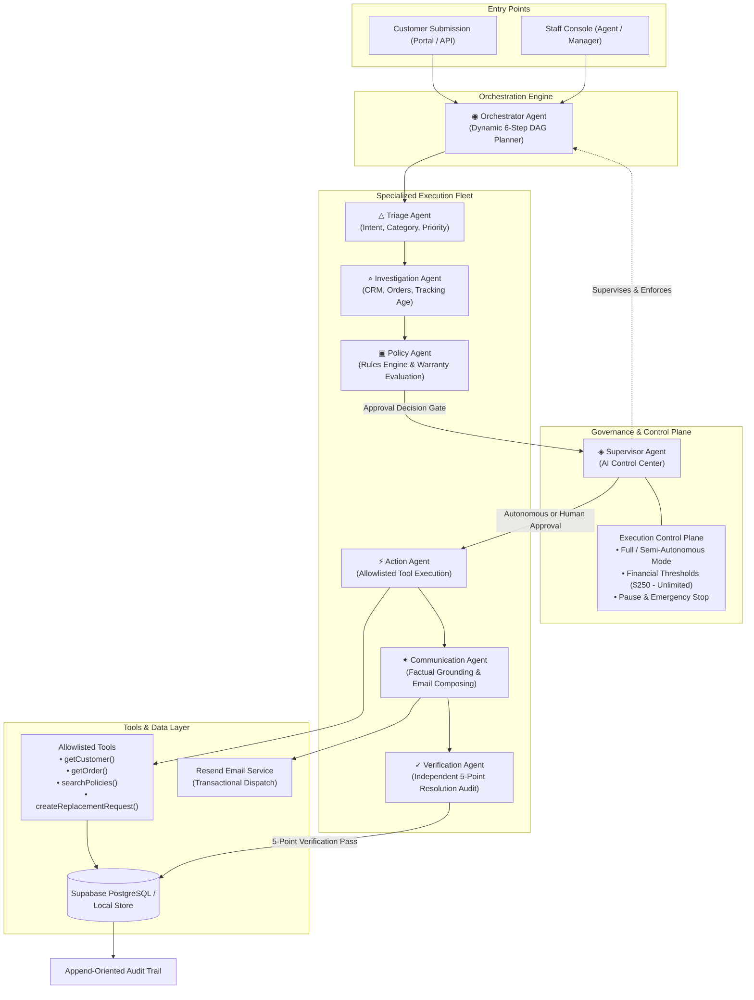
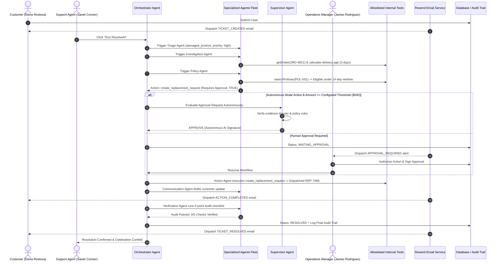

<div align="center">

# ⚡ RESOLVE.AI

### Autonomous Agentic Customer Operations Platform
**From customer issue to verified resolution — autonomously.**

<p align="center">
  <em>Theme: Agentic AI & Intelligent Systems &nbsp;|&nbsp; Hackathon Submission</em>
</p>

<p align="center">
  <a href="https://astra4-delta.vercel.app/">
    
  </a>
  <a href="https://github.com/shreyash-bhosale/Astra-4">
    
  </a>
  <a href="./docs/screenshots/resolveai-demo-walkthrough.gif">
    
  </a>
  <a href="./LICENSE">
    
  </a>
</p>

<p align="center">
  
</p>

<p align="center">
  
  
  
  
  
  
  
  
  
</p>

</div>

---

## 📑 Table of Contents

1. [What is ResolveAI?](#-what-is-resolveai)
2. [Problem Statement & Enterprise Value](#-problem-statement--enterprise-value)
3. [The Solution: Multi-Agent Operations](#-the-solution-multi-agent-operations)
4. [Why ResolveAI is Actually Agentic](#-why-resolveai-is-actually-agentic)
5. [The 8-Agent Supervisory Topology](#-the-8-agent-supervisory-topology)
6. [AI Governance & Safety Controls](#-ai-governance--safety-controls)
7. [AI Security & Defense-in-Depth](#-ai-security--defense-in-depth)
8. [Automated Transactional Email System (Resend)](#-automated-transactional-email-system-resend)
9. [Customer Care Portal](#-customer-care-portal)
10. [End-to-End Workflow & Diagrams](#-end-to-end-workflow--diagrams)
11. [User Interface & Screenshots Gallery](#-user-interface--screenshots-gallery)
12. [Technology Stack](#-technology-stack)
13. [Repository & Project Structure](#-repository--project-structure)
14. [REST API Documentation](#-rest-api-documentation)
15. [Database Architecture & Dual-Store Engine](#-database-architecture--dual-store-engine)
16. [Authentication & Role-Based Access (RBAC)](#-authentication--role-based-access-rbac)
17. [Environment Variables](#-environment-variables)
18. [Local Quickstart & Installation](#-local-quickstart--installation)
19. [Automated Testing & Audit Evidence](#-automated-testing--audit-evidence)
20. [Production Deployment Guide](#-production-deployment-guide)
21. [Hackathon Judge 3-Minute Demo Script](#-hackathon-judge-3-minute-demo-script)
22. [Team & License](#-team--license)

---

## 💡 What is ResolveAI?

**ResolveAI** is an **autonomous agentic customer operations platform** that investigates customer support tickets, plans multi-step resolution workflows, queries internal databases, reasons over active company warranty and return policies, coordinates specialized AI agents, and enforces strict **policy-governed authorization gates** before executing operational actions.

Unlike conversational chatbots that merely generate conversational text, ResolveAI operates as an **auditable operations engine**:
* **Investigates** CRM customer records, purchase histories, and carrier tracking timestamps.
* **Evaluates** company legal policies, return rules, and warranty coverage windows deterministically.
* **Provisions** replacement requests and internal status updates through gated tools.
* **Automates** transactional customer notifications and managerial alerts via **Resend** with smart sandbox fallbacks.
* **Audits** every resolution with an independent 5-point verification gate before any ticket can be closed.
* **Governs** operations via the **ResolveAI Supervisor Agent** with configurable autonomous financial thresholds ($250 to unlimited) and immediate emergency stop controls.
* **Logs** an append-oriented audit trail recording every agent thought, tool execution, and supervisor decision.

---

## 🎯 Problem Statement & Enterprise Value

### The Real-World Pain
Customer operations teams at e-commerce, hardware, and digital commerce companies face persistent operational friction:
1. **Fragmented Data Silos:** Support representatives spend case handling time toggling between ticket queues, CRM profiles, order management records, carrier tracking portals, and internal policy documents.
2. **Repetitive Calculation Fatigue:** Agents manually compute whether a damaged item arrived within a 14-day warranty policy window or verify whether an order is eligible for pre-dispatch cancellation.
3. **The "Black-Box" Bot Risk:** Conventional LLM chatbots frequently hallucinate false promises to customers (e.g., promising full refunds outside policy) or lack the programmatic safety controls required to execute internal tools without runaway financial or inventory risk.
4. **Lack of Auditability:** Standard support software fails to capture a transparent chain of reasoning showing *why* a replacement was approved, *which* policy clause applied, and *who* verified the evidence.

### The ResolveAI Value
* **Autonomous Resolution:** Resolves routine warranty claims, defective product replacements, wrong shipments, and pre-dispatch cancellations in seconds rather than hours.
* **Deterministic Policy Enforcement:** Eliminates calculation errors by programmatically evaluating policy clauses against verifiable timestamps and database records.
* **Guarded Financial Boundaries:** Sensitive operations (replacements, large refunds) are held at an authorization gate until reviewed by a human supervisor or autonomously handled within strict financial limits.
* **Automated Customer Communication:** Dispatches professional, fact-checked transactional emails automatically on key lifecycle events without requiring manual drafting.
* **Explainable Reasoning:** An append-oriented audit log records every agent thought, tool call parameter, policy citation, and human/supervisor decision.

---

## 🛠️ The Solution: Multi-Agent Operations

ResolveAI organizes operations into an **8-Agent Supervisory Topology** combining a supervisory governance layer with seven specialized execution agents:



---

## 🧩 Why ResolveAI is Actually Agentic

ResolveAI is **not** a standard wrapper around an LLM chat endpoint. In simple LLM chatbots, the architecture is linear:

```text
Traditional Chatbot:
User ───> LLM Prompt ───> Text Response (No tools, no validation, high hallucination risk)
```

In ResolveAI, the system operates as a **coordinated multi-agent pipeline**:

```text
ResolveAI Agentic Workflow:
Customer Issue
      ↓
[Orchestrator Agent] ─── Formulates dynamic DAG plan with step dependencies
      ↓
[Triage Agent] ──────── Semantic classification, entity extraction & priority scoring
      ↓
[Investigation Agent] ─ Queries CRM, order records & computes carrier delivery age
      ↓
[Policy Agent] ──────── Evaluates active company policies against gathered evidence
      ↓
[Supervisor Gate] ───── Evaluates risk; enforces autonomy thresholds & human approval
      ↓
[Action Agent] ──────── Invokes allowlisted internal tools in a simulated execution sandbox
      ↓
[Communication Agent] ─ Composes fact-checked emails strictly grounded in verified facts
      ↓
[Verification Agent] ── Independent auditor executing a 5-point verification checklist
      ↓
[Resolved State] ────── Ticket closed, customer notified via Resend, audit trail appended
```

### Why this qualifies as Agentic AI:
1. **Dynamic Decomposition:** The Orchestrator generates a tailored Directed Acyclic Graph (DAG) for each case.
2. **Specialized Roles:** Different agents have bounded responsibilities, distinct prompts, and isolated tool access.
3. **Environment Interaction:** Agents read from databases and execute state-changing tools (e.g., dispatching replacement orders).
4. **Policy-Bounded Reasoning:** Decisions are grounded in structured company rules rather than unconstrained LLM completion.
5. **Self-Auditing:** The Verification Agent acts as an independent reviewer with authority to reject incomplete resolutions.

---

## 🤖 The 8-Agent Supervisory Topology

| Agent | Icon | Specialized Responsibility | Internal Tools Used | Zod Output Schema |
| :--- | :---: | :--- | :--- | :--- |
| **Supervisor Agent** | `◈` | Oversees fleet health, evaluates approval requests autonomously, enforces financial thresholds, provides operational telemetry chat, and executes emergency halts. | Fleet Telemetry, Control Plane, Policy Audit | `SupervisorDecisionSchema` |
| **Orchestrator Agent** | `◉` | Formulates 6-step dynamic DAG resolution plan, coordinates agent handoffs, enforces step dependencies, and manages pause/resume states. | DAG State Machine | `PlanOutputSchema` |
| **Triage Agent** | `△` | Analyzes ticket title/description, extracts entities (order IDs, product names), and classifies category and urgency. | Semantic Classifier | `TriageOutputSchema` |
| **Investigation Agent** | `⌕` | Queries CRM databases, retrieves purchase records, and computes carrier delivery age against warranty policy windows. | `getCustomer()`, `getOrder()`, `getCustomerOrders()`, `getTicketHistory()` | `InvestigationOutputSchema` |
| **Policy Agent** | `▣` | Searches active policy database, evaluates warranty rules against evidence, and flags actions requiring authorization. | `searchPolicies()` | `PolicyOutputSchema` |
| **Action Agent** | `⚡` | Executes allowlisted internal tools in simulated environment; halts at authorization gate for sensitive actions. | `createReplacementRequest()`, `updateTicketStatus()`, `createInternalTask()`, `createEscalation()` | `ActionOutputSchema` |
| **Communication Agent** | `✦` | Generates personalized customer notifications and internal briefings strictly grounded in verified evidence dossiers. | Contextual Formatter | `CommunicationOutputSchema` |
| **Verification Agent** | `✓` | Independent auditor running a 5-point checklist before authorizing final ticket resolution. | Audit Validator | `VerificationOutputSchema` |

---

## 🛡️ AI Governance & Safety Controls

ResolveAI adopts a clear engineering philosophy:
> **AI models can reason and recommend, but execution is constrained by deterministic authorization gates, policy boundaries, schema validation, and control-plane enforcement.**

### 1. Autonomy Modes & Thresholds
Administrators configure autonomy through the **AI Control Center**:
* **Full Autonomous Mode:** The Supervisor Agent evaluates approval requests autonomously against active policy rules. If the financial value is at or below the configured threshold, the Supervisor authorizes the action and triggers execution.
* **Semi-Autonomous / Gated Mode:** All sensitive actions (replacements, cancellations, refunds) pause at the Human-in-the-Loop approval gate for manager authorization.
* **Configurable Financial Thresholds:** Tiered limits ($250, $500, $1,000, $2,500, Unlimited). Any request exceeding the threshold is automatically escalated to a human operations manager regardless of autonomy mode.

### 2. Execution Control Plane (Pause & Killswitch)
* **Pause Directive:** Halts new autonomous AI workflows across the platform instantly while allowing staff to review existing cases.
* **Emergency Stop:** Actively halts in-flight agent runs, blocks pending tool invocations, and appends security audit records. Both `orchestrator.js` and `supervisorAgent.js` enforce backend execution checks that return `403 Forbidden` if active operations are paused or stopped.

---

## 🔐 AI Security & Defense-in-Depth

Defense-in-depth controls reduce the risk of unauthorized AI actions and data leakage:

| Threat Category | Potential Risk | ResolveAI Defense Mechanism | Code Implementation |
| :--- | :--- | :--- | :--- |
| **Prompt Injection** | Customer ticket attempts to override system prompt | Untrusted customer input is isolated in dedicated data delimiters; system instructions explicitly forbid instruction execution from ticket text. | `aiService.js` |
| **AI Hallucination** | LLM invents nonexistent refund amounts or tracking IDs | Structured output validation; communication agent is strictly restricted to verified evidence dossier fields. | `validators/index.js`, `communicationAgent.js` |
| **Unauthorized Action** | AI executes unapproved commands or arbitrary code | Hardcoded tool allowlist; tool execution occurs only through pre-registered JavaScript functions. | `tools/index.js` |
| **Privilege Escalation** | Customer attempts to access staff endpoints or admin tools | JWT authentication with role-based route middleware (`requireRole(['admin', 'manager'])`). | `authMiddleware.js` |
| **Cross-Tenant Access** | Customer tries to access another customer's ticket data | Strict customer ownership verification; requests for other customer data return `403 Forbidden`. | `customerPortalController.js` |
| **Malformed Output** | AI generates invalid or unparseable JSON | Strict Zod schema parsing; invalid outputs trigger controlled heuristic fallbacks without crashing. | `validators/index.js` |
| **Duplicate Actions** | Network retries trigger double replacements or emails | Idempotency keys generated from ticket ID, event type, and run hash prevent duplicate executions. | `emailService.js`, `actionAgent.js` |
| **Email Header Injection** | Attacker inserts CRLF (`\r\n`) to inject BCC recipients | Strict header sanitization strips carriage returns and newlines; strict regex validates email syntax. | `emailService.js` |
| **API Denial of Service** | Rapid repeated requests flood AI endpoints | Express rate limiting on sensitive routes (auth, email dispatch, AI workflow triggers). | `middleware/rateLimiter.js` |

---

## 📧 Automated Transactional Email System (Resend)

ResolveAI features an automated transactional email subsystem powered by **Resend**:

```text
Backend Event Trigger ───> EmailService ───> Template Renderer ───> Resend API ───> Customer Inbox
                                  │
                                  ├── If Resend Free Tier Sandbox Constraint (403/422):
                                  └── Safely routes live email to verified developer inbox
```

### Supported Transactional Events:
1. `TICKET_CREATED`: Sent when a customer submits a new case.
2. `TICKET_STATUS_UPDATED`: Sent when investigation or DAG progress advances.
3. `APPROVAL_REQUIRED`: Dispatched to operations managers when a sensitive action requires human authorization.
4. `ACTION_COMPLETED`: Sent when warehouse replacement is provisioned.
5. `TICKET_RESOLVED`: Comprehensive resolution report with replacement tracking numbers.
6. `ADMIN_TEST`: Verification test dispatch triggered from the Admin Settings console.

### Sandbox Compatibility:
When running with an unverified domain (`onboarding@resend.dev`), Resend restricts outbound delivery to the account owner's email address. ResolveAI incorporates **automatic sandbox fallback routing**:
- If an email is intended for a customer (e.g., `elena.rostova@example.com`), the backend detects the sandbox constraint and **routes the live email to the verified developer email**, prepending a notification banner indicating the intended recipient.
- Once a custom domain is verified in Resend, emails deliver directly to external recipients without configuration changes.

---

## 👥 Customer Care Portal

The customer portal (`/customer`) provides an interface for consumers to manage support cases:

* **Customer Home (`/customer`):** High-level summary of active tickets, resolved issues, customer account tier, and quick actions.
* **Raise an Issue (`/customer/issues/new`):** Submission flow with order selection, issue category picker, description textarea, and celebratory confetti upon completion.
* **Issue Tracking (`/customer/issues/:id`):** Real-time progress tracker with step-by-step resolution status and visibility-aware polling.
* **Order History (`/customer/orders`):** View past purchases, order amounts, and one-click "Report Problem" buttons.
* **AI Support Assistant (`/customer/support`):** Real-time conversational agent grounded in the customer's orders and company policies.
* **Profile & Notification Settings (`/customer/profile`):** Manage email delivery preferences (opt-in / opt-out).

---

## 🔄 End-to-End Workflow & Diagrams

### Sequence of an Elena Rostova Case Resolution



---

## 🖼️ User Interface & Screenshots Gallery

All screenshots below are included in the repository under [`docs/screenshots/`](./docs/screenshots/):

### 1. Futuristic Liquid-Metal Landing Page Hero (Dark & Light Mode)
<p align="center">
  
  
</p>

### 2. Multi-Agent Fleet Showcase & Polished Status Monitor
<p align="center">
  
</p>

### 3. Operations Dashboard & Real-Time Fleet Health
<p align="center">
  
</p>

### 4. Interactive 6-Step DAG Execution Workspace & Human-in-the-Loop Gate
<p align="center">
  
  
</p>

### 5. Verified Case Resolution with Append-Oriented Audit Trail
<p align="center">
  
</p>

### 6. Rapid Evaluation Login Screen with 1-Click Demo Personas
<p align="center">
  
</p>

---

## 💻 Technology Stack

| Layer | Technology | Version | Purpose in ResolveAI |
| :--- | :--- | :--- | :--- |
| **Frontend Framework** | React | `^19.2.8` | Component architecture, state management, hooks. |
| **Client Router** | React Router DOM | `^7.18.4` | Single-page application routing, protected route wrappers. |
| **Frontend Bundler** | Vite | `^8.3.0` | Build tooling, fast hot module replacement (HMR). |
| **3D Canvas Engine** | Three.js | `^0.186.1` | Procedural liquid-metal hero mesh with `MeshPhysicalMaterial`. |
| **Visual Elements** | Lucide React | `^1.49.0` | Consistent iconography across staff and customer views. |
| **Backend Runtime** | Node.js | `>=18.0.0` | ES Modules runtime (`"type": "module"`). |
| **Web Server** | Express | `^4.21.2` | RESTful API server, middleware pipeline, error handling. |
| **AI LLM Engine** | Google Gemini | Flash 3.5 / Flash Latest | Agentic reasoning, semantic extraction, decision generation. |
| **Fallback Engine** | Heuristic Reasoner | Custom | Deterministic offline execution guaranteeing uptime during API limits. |
| **Email Provider** | Resend | `^6.31.0` | Transactional email delivery with sandbox routing. |
| **Primary Database** | Supabase PostgreSQL | `^2.49.1` | Relational storage for production environments. |
| **Fallback Store** | File-backed JSON | Custom | Self-healing local database for offline development. |
| **Schema Validation** | Zod | `^3.24.2` | Strict schema validation for API inputs and agent outputs. |
| **Authentication** | JWT + bcryptjs | `^9.0.2` / `^3.0.2` | Token-based authentication and password hashing. |
| **Rate Limiting** | express-rate-limit | `^8.7.0` | Protection against abuse on public endpoints. |

---

## 📁 Repository & Project Structure

```text
Astra-4/
├── .agents/
│   └── rules/
│       └── ui-ux.md                 # UI/UX design rules (Liquid metal, typography, grid)
├── backend/                         # Express REST API & Multi-Agent Engine
│   ├── data/
│   │   └── store.json               # Self-healing local JSON database
│   ├── src/
│   │   ├── agents/                  # 8 Specialized AI Agents
│   │   │   ├── supervisorAgent.js   # Supervisory AI, autonomous approvals, control plane
│   │   │   ├── actionAgent.js       # Action execution engine & approval requester
│   │   │   ├── communicationAgent.js# Customer email & summary generator
│   │   │   ├── investigationAgent.js# CRM & carrier delivery investigator
│   │   │   ├── orchestrator.js      # Dynamic DAG state machine & pipeline runner
│   │   │   ├── policyAgent.js       # Policy search & warranty reasoner
│   │   │   ├── triageAgent.js       # Intent, category & urgency classifier
│   │   │   └── verificationAgent.js # 5-point independent audit verifier
│   │   ├── config/
│   │   │   └── env.js               # Environment variables configuration
│   │   ├── controllers/             # REST Route controllers
│   │   │   ├── activityController.js# Audit trail and activity feeds
│   │   │   ├── approvalController.js# Supervisor approve / reject actions
│   │   │   ├── authController.js    # Login, registration, token verification
│   │   │   ├── customerController.js# Customer CRM management
│   │   │   ├── customerPortalController.js # Customer portal endpoints
│   │   │   ├── emailController.js   # Email status, logs, and test dispatch
│   │   │   ├── orderController.js   # Order transaction records
│   │   │   ├── policyController.js  # Warranty & return policies
│   │   │   ├── supervisorController.js # Supervisor telemetry & control
│   │   │   ├── systemController.js  # Health check & demo reset seeds
│   │   │   └── ticketController.js  # Ticket CRUD & AI workflow triggers
│   │   ├── db/
│   │   │   ├── seed.js              # Database seed CLI script
│   │   │   ├── seedData.js          # Initial seed personas, orders, policies
│   │   │   └── store.js             # Dual-store database engine
│   │   ├── middleware/
│   │   │   ├── authMiddleware.js    # JWT verification & RBAC
│   │   │   ├── errorHandler.js      # Global error handling
│   │   │   └── rateLimiter.js       # Express rate limiting
│   │   ├── routes/                  # Express API route declarations
│   │   ├── services/
│   │   │   ├── aiService.js         # Google Gemini integration & fallback
│   │   │   ├── emailService.js      # Resend email dispatcher with sandbox routing
│   │   │   └── emailTemplates.js    # HTML/text transactional email templates
│   │   ├── tools/
│   │   │   └── index.js             # Allowlisted internal tools
│   │   ├── validators/
│   │   │   └── index.js             # Zod input & AI schema declarations
│   │   └── server.js                # Server entry point (Port 5001)
│   ├── test-email-automation.js     # 36-assertion email test suite
│   ├── test-full-system-audit.js    # 23-assertion full system test suite
│   ├── test-supervisor-autonomy.js  # Supervisor autonomy test suite
│   ├── package.json
│   └── render.yaml                  # Render deployment configuration
├── docs/
│   ├── DEMO_SCRIPT.md               # Timed 3-minute hackathon video script
│   └── screenshots/                 # Screenshot gallery & walkthrough GIF
├── frontend/                        # React 19 + Vite Web Application
│   ├── public/                      # Static assets & icons
│   ├── src/
│   │   ├── assets/                  # Hero artwork & SVG icons
│   │   ├── components/              # LiquidMetalHeroCanvas, ThemeToggle, ErrorBoundary
│   │   ├── context/                 # AuthContext (1-click personas), ThemeContext
│   │   ├── hooks/                   # useScrollReveal (IntersectionObserver)
│   │   ├── layouts/                 # DashboardLayout, CustomerLayout
│   │   ├── pages/                   # Application pages
│   │   │   ├── LandingPage.jsx      # Futuristic hero & agent fleet showcase
│   │   │   ├── LoginPage.jsx        # Login & 1-click evaluator personas
│   │   │   ├── RegisterPage.jsx     # Registration screen
│   │   │   ├── DashboardPage.jsx    # Metrics, fleet monitor & approvals spotlight
│   │   │   ├── TicketsListPage.jsx  # Filterable ticket queue & creation modal
│   │   │   ├── TicketWorkspacePage.jsx # Interactive DAG execution & audit timeline
│   │   │   ├── ApprovalsPage.jsx    # Supervisor human approval queue
│   │   │   ├── CustomersPage.jsx    # Customer directory & order history
│   │   │   ├── OrdersPage.jsx       # Orders & tracking lookup
│   │   │   ├── PoliciesPage.jsx     # Active policy editor & browser
│   │   │   ├── ActivityPage.jsx     # Real-time multi-agent activity stream
│   │   │   ├── AIControlCenterPage.jsx # AI Control Center & Supervisor settings
│   │   │   ├── SettingsPage.jsx     # Model settings, email tests & demo reset
│   │   │   └── customer/            # Customer Care Portal pages
│   │   │       ├── CustomerHomePage.jsx     # Customer dashboard
│   │   │       ├── CustomerIssuesPage.jsx   # Customer ticket list
│   │   │       ├── CustomerIssueDetailPage.jsx # Real-time tracking
│   │   │       ├── RaiseIssuePage.jsx       # Issue submission with order link
│   │   │       ├── CustomerOrdersPage.jsx   # Order history
│   │   │       ├── CustomerAISupportPage.jsx# AI Support chat
│   │   │       └── CustomerProfilePage.jsx  # Notification preferences
│   │   ├── services/
│   │   │   ├── api.js               # Frontend API client
│   │   │   └── clientMockStore.js   # Offline high-fidelity mock store
│   │   ├── App.jsx                  # Application routing & protected routes
│   │   ├── index.css                # Pure Vanilla CSS design system & tokens
│   │   └── main.jsx                 # React root mount
│   ├── package.json
│   ├── vercel.json                  # Vercel SPA rewrite configuration
│   └── vite.config.js
├── LICENSE                          # MIT License
├── DEPLOYMENT.md                    # Detailed deployment instructions
├── supabase-schema.sql              # Supabase PostgreSQL schema with RLS
└── package.json                     # Root orchestrator scripts
```

---

## 🔌 REST API Documentation

All routes under `/api` require `Authorization: Bearer <token>` unless marked Public.

### Authentication
* `POST /api/auth/login` (Public) — Authenticate user and receive signed JWT.
* `POST /api/auth/register` (Public) — Register a new account.
* `GET /api/auth/me` — Retrieve authenticated user profile.

### Tickets & Multi-Agent Execution
* `GET /api/tickets` — List tickets with optional status, priority, and search filters.
* `POST /api/tickets` — Create a new customer support ticket.
* `GET /api/tickets/:id` — Retrieve ticket details, active run, and audit logs.
* `POST /api/tickets/:id/run` — Launch autonomous 8-agent resolution workflow.
* `POST /api/tickets/:id/notes` — Append internal team notes to ticket.

### AI Control Center & Supervisor
* `GET /api/supervisor/status` — Operational status, fleet health, and autonomy mode.
* `POST /api/supervisor/settings` (Admin) — Update autonomy mode and financial threshold.
* `POST /api/supervisor/chat` — Query Supervisor Agent with natural language inquiries.
* `POST /api/supervisor/emergency-stop` (Admin) — Trigger emergency halt of active runs.

### Approvals
* `GET /api/approvals` — List authorization requests (`PENDING`, `APPROVED`, `REJECTED`).
* `POST /api/approvals/:id/approve` (Manager/Admin) — Authorize action and resume workflow.
* `POST /api/approvals/:id/reject` (Manager/Admin) — Reject action with reviewer notes.

### Transactional Emails
* `GET /api/emails/status` — Operational status of email subsystem.
* `POST /api/emails/test` (Admin) — Trigger test verification email.
* `GET /api/emails/logs` — Outbound transactional email audit log.

### Customer Portal
* `GET /api/customer/profile` — Authenticated customer profile and order stats.
* `GET /api/customer/tickets` — Issues submitted by the authenticated customer.
* `POST /api/customer/tickets` — Raise a new customer support issue.
* `GET /api/customer/orders` — Order history for the authenticated customer.
* `GET /api/customer/notifications` — Notification drawer items.
* `POST /api/customer/chat` — Conversational AI Support Assistant.

---

## 🗄️ Database Architecture & Dual-Store Engine

ResolveAI implements a dual-store database architecture:

1. **Production Mode (Supabase PostgreSQL):** Used in production deployments. Backed by PostgreSQL with Row Level Security (RLS) policies. Schema defined in [`supabase-schema.sql`](./supabase-schema.sql).
2. **Development / Fallback Mode (Local File Store):** Used for offline development and local quickstarts. Backed by a self-healing JSON store (`backend/data/store.json`) that seeds automatically on boot if empty.

### Verified Database Tables:
* **`users`**: User credentials, hashed passwords, roles (`admin`, `manager`, `agent`, `customer`).
* **`customers`**: CRM directory, verified email addresses, tier status (`VIP Enterprise`, `Standard`).
* **`orders`**: Transaction records, tracking numbers, items, purchase and delivery timestamps.
* **`policies`**: Active company policies (`POL-001`, `POL-002`, etc.) with eligibility clauses.
* **`tickets`**: Support cases with priority, status (`OPEN`, `INVESTIGATING`, `WAITING_APPROVAL`, `RESOLVED`).
* **`agent_runs`**: Execution runs storing the dynamic DAG plan, active step, and verification results.
* **`approvals`**: Authorization requests with financial risk levels, supervisor decisions, and reviewer notes.
* **`email_notifications`**: Outbound email logs, delivery IDs, status (`SENT`, `QUEUED`, `FAILED`).
* **`audit_logs`**: Append-oriented audit trail recording every agent action, tool invocation, and decision.

---

## 👤 Authentication & Role-Based Access (RBAC)

ResolveAI provides pre-seeded **1-click evaluation personas** on the login screen:

| Persona | Role | Email | Password | Access Permissions |
| :--- | :--- | :--- | :--- | :--- |
| **Sarah Connor** | `agent` | `sarah.connor@resolveai.io` | `password123` | Ticket Workspace, Trigger AI Runs, View Activity |
| **James Rodriguez** | `manager` | `james.rodriguez@resolveai.io` | `password123` | Approvals Queue, Authorize/Reject Actions, Policies |
| **Alex Vance** | `admin` | `admin@resolveai.io` | `password123` | AI Control Center, Email Testing, Autonomy Settings |
| **Elena Rostova** | `customer` | `elena.rostova@example.com` | `password123` | Customer Portal, Raise Issues, Orders, AI Chat |

---

## 🔑 Environment Variables

Create a `.env` file in the project root:

```env
# Server Configuration
PORT=5001
NODE_ENV=development
FRONTEND_URL=http://localhost:5173

# Security & Authentication
JWT_SECRET=replace-with-a-secure-jwt-secret-string

# Google Gemini AI Integration
GEMINI_API_KEY=your-gemini-api-key-here
GEMINI_MODEL=gemini-flash-latest

# Transactional Email Provider (Resend)
RESEND_API_KEY=re_your-resend-api-key-here
EMAIL_FROM=ResolveAI <onboarding@resend.dev>
EMAIL_REPLY_TO=support@resolveai.io
MANAGER_NOTIFICATION_EMAIL=manager@resolveai.io
EMAIL_MODE=provider
RESEND_TEST_RECIPIENT=your-verified-email@example.com

# Database (Supabase PostgreSQL - Optional, falls back to local store)
NEXT_PUBLIC_SUPABASE_URL=https://your-project.supabase.co
SUPABASE_SERVICE_ROLE_KEY=your-supabase-service-role-key
```

---

## 🚀 Local Quickstart & Installation

### Prerequisites
* **Node.js**: v18.0.0 or higher
* **npm**: v9.0.0 or higher

### 1. Clone the Repository
```bash
git clone https://github.com/shreyash-bhosale/Astra-4.git
cd Astra-4
```

### 2. Install Dependencies
```bash
# Install backend and frontend dependencies
cd backend && npm install
cd ../frontend && npm install
cd ..
```

### 3. Configure Environment
```bash
cp .env.example .env
# Edit .env with your Google Gemini API key or leave blank for deterministic fallback mode
```

### 4. Run Development Servers
```bash
# Terminal 1: Start Backend (Port 5001)
npm run dev:backend

# Terminal 2: Start Frontend (Port 5173)
npm run dev:frontend
```
* **Frontend Application:** `http://localhost:5173`
* **Backend API:** `http://localhost:5001`
* **Health Check:** `http://localhost:5001/api/health`

---

## 🧪 Automated Testing & Audit Evidence

ResolveAI includes automated test suites covering the entire system:

### 1. Full System Audit Suite (23 Assertions)
```bash
node backend/test-full-system-audit.js
```
```text
======================================================
🚀 RESOLVEAI FULL SYSTEM AUDIT & VERIFICATION SUITE
======================================================
--- Phase 1: Authentication & RBAC ---
✅ [PASS] Admin login successful
✅ [PASS] Admin role verified
✅ [PASS] Customer login successful
✅ [PASS] Customer role verified

--- Phase 2: BUG 01 Policy Creation & Persistence ---
✅ [PASS] Policy creation succeeds with formatted POL-xxx ID
✅ [PASS] Newly created policy persists in policies list
✅ [PASS] Invalid policy rejected with 400 Bad Request

--- Phase 3: BUG 02 & BUG 06 Supervisor AI Telemetry ---
✅ [PASS] Supervisor answers autonomous mode telemetry query
✅ [PASS] Supervisor inspects specific ticket contextually

--- Phase 4: BUG 11 Customer Orders & Spend Aggregation ---
✅ [PASS] Customers list retrieved
✅ [PASS] Found sample customer record (Elena Rostova)
✅ [PASS] Customer ordersCount correctly calculated: 1
✅ [PASS] Customer totalSpent correctly aggregated: $349

--- Phase 5: BUG 08 Internal Notes Persistence ---
✅ [PASS] Internal note 1 added successfully
✅ [PASS] Multiple internal notes persist distinctly without overwriting
✅ [PASS] Empty/whitespace internal note rejected with 400

--- Phase 6: BUG 10 Execution Control Plane (Pause / Stop Enforcement) ---
✅ [PASS] Execution blocked when Autonomous AI is PAUSED
✅ [PASS] Execution blocked when EMERGENCY STOP is engaged
✅ [PASS] Autonomous AI Mode restored cleanly

--- Phase 7: BUG 05 & BUG 07 Customer Portal Issues & Orders ---
✅ [PASS] Customer can view own orders list
✅ [PASS] Customer successfully created Issue 1
✅ [PASS] Customer successfully created Issue 2 (Multiple issues permitted)

--- Phase 8: Security & Customer Isolation ---
✅ [PASS] Customer data isolation verified: Unauthorized ticket access returns 403 Forbidden

======================================================
📊 AUDIT RESULTS SUMMARY: 23 PASSED | 0 FAILED
======================================================
```

### 2. Transactional Email Automation Suite (36 Assertions)
```bash
node backend/test-email-automation.js
```
```text
===============================================================
🧪 ResolveAI — Transactional Email Automation Test Suite
===============================================================
1. Health Check Verification (GET /api/health)          — 4/4 PASSED
2. User Authentication (Admin & Customer)               — 1/1 PASSED
3. Email Subsystem Status (GET /api/emails/status)      — 6/6 PASSED
4. Admin-Only Test Dispatch Protection                  — 6/6 PASSED
5. Automated Workflow Events via EmailService           — 11/11 PASSED
6. Customer Email Preferences Enforcement               — 2/2 PASSED
7. Security & Header Injection Prevention               — 3/3 PASSED
8. Email Audit Log (GET /api/emails/logs)               — 3/3 PASSED
===============================================================
📊 Test Results: 36 PASSED | 0 FAILED
===============================================================
```

### 3. Production Frontend Bundle Check
```bash
cd frontend && npm run build
# Built cleanly in < 250ms with 0 errors
```

---

## 🚢 Production Deployment Guide

### Frontend on Vercel
1. Framework Preset: **Vite**
2. Root Directory: `frontend`
3. Build Command: `npm run build`
4. Output Directory: `dist`
5. Environment Variables:
   * `VITE_API_URL=https://your-backend-api.com/api`

### Backend on Render / Railway
1. Environment: **Node**
2. Root Directory: `backend`
3. Build Command: `npm install`
4. Start Command: `node src/server.js`
5. Configure environment variables according to the [Environment Variables](#-environment-variables) section.

---

## 🎤 Hackathon Judge 3-Minute Demo Script

| Time | Stage | Action | What to Observe |
| :--- | :--- | :--- | :--- |
| **0:00 - 0:30** | **Product & Architecture** | Open `http://localhost:5173`. Show the 3D Liquid-Metal Hero, toggle Dark/Light mode, and scroll to the **8-Agent Fleet Showcase**. | Procedural Three.js liquid chrome, responsive grid, clear supervisory agent architecture. |
| **0:30 - 1:00** | **Case Investigation** | Click "Login" -> 1-Click "Sarah Connor (Agent)". Open Ticket `#tkt-001`. Click **"Run ResolveAI"**. | Watch the DAG plan execute: Triage -> Investigation -> Policy -> Halting at **Approval Gate**. |
| **1:00 - 1:45** | **AI Governance & Control** | Switch to "Alex Vance (Admin)". Open **AI Control Center**. Show Autonomous AI Mode, adjust the financial limit to $500, and query the Supervisor: *"What is the status of TKT-001?"* | Policy-bounded autonomy settings, real-time telemetry chat grounded in live database state. |
| **1:45 - 2:20** | **Manager Approval & Execution** | Switch to "James Rodriguez (Manager)". Open **Approvals Queue**. Review the evidence dossier and click **"Authorize Action & Resume"**. | Action Agent provisions replacement `REP-7466`, Communication Agent drafts email, Verification Agent checks all 5 points. |
| **2:20 - 3:00** | **Customer Portal & Email Dispatch** | Switch to "Elena Rostova (Customer)" at `/customer`. Show the resolved ticket, tracking number, and inspect the transactional email dispatch log. | Complete loop: from customer problem to verified resolution with full audit trail. |

---

## 👨‍💻 Team & License

Built for the **Agentic AI & Intelligent Systems Hackathon**.

### Team Members:
* **Sparsh Shrivastav** — Team Leader
* **Shreyash Bhosale** — Engineer
* **Vatsal Pithwa** — Engineer
* **Uzair Pathan** — Engineer

### License:
This project is licensed under the **MIT License**. See the [`LICENSE`](./LICENSE) file for details.
