<div align="center">

# ⚡ RESOLVE.AI

### Autonomous Agentic Customer Operations Platform
**From customer issue to verified resolution — autonomously.**

<p align="center">
  <em>Theme: Agentic AI & Intelligent Systems &nbsp;|&nbsp; Production-Grade Hackathon Submission</em>
</p>

<p align="center">
  <a href="https://astra-4-opal.vercel.app/">
    
  </a>
  <a href="https://github.com/shreyash-bhosale/Astra-4">
    
  </a>
  <a href="#-product-demo">
    
  </a>
  <a href="./LICENSE">
    
  </a>
</p>

<p align="center">
  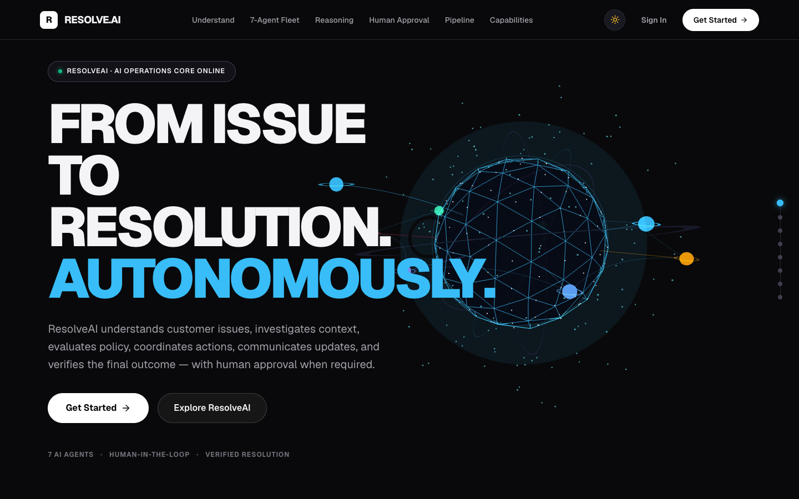
</p>

<p align="center">
  <em><strong>From Issue to Resolution. Autonomously.</strong><br/>
  ResolveAI understands customer issues, investigates CRM context, evaluates deterministic company policy, coordinates warehouse and account tools, dispatches transactional notifications, and audits the final outcome — with human-in-the-loop authorization gates when required.</em>
</p>

<p align="center">
  
  
  
  
  
  
  
  
  
  
</p>

</div>

---

## 📑 Table of Contents

1. [What is ResolveAI?](#-what-is-resolveai)
2. [The Problem](#-the-problem)
3. [The Solution](#-the-solution)
4. [Why ResolveAI is Actually Agentic](#-why-resolveai-is-actually-agentic)
5. [The 8-Agent Supervisory Topology](#-the-8-agent-supervisory-topology)
6. [AI Governance & Autonomous Control](#-ai-governance--autonomous-control)
7. [AI Security & Defense-in-Depth](#-ai-security--defense-in-depth)
8. [Product Demo](#-product-demo)
9. [Demo Credentials](#-demo-credentials)
10. [Transactional Email System](#-transactional-email-system)
11. [Customer Care Portal](#-customer-care-portal)
12. [End-to-End System Architecture](#-end-to-end-system-architecture)
13. [End-to-End Workflow Sequence](#-end-to-end-workflow-sequence)
14. [User Interface & Screenshot Gallery](#-user-interface--screenshot-gallery)
15. [Technology Stack](#-technology-stack)
16. [Project Structure](#-project-structure)
17. [REST API Documentation](#-rest-api-documentation)
18. [Database Architecture & Dual-Store Engine](#-database-architecture--dual-store-engine)
19. [Authentication & Role-Based Access Control (RBAC)](#-authentication--role-based-access-control-rbac)
20. [Environment Variables](#-environment-variables)
21. [Local Installation & Setup](#-local-installation--setup)
22. [Testing & Verification Evidence](#-testing--verification-evidence)
23. [Production Deployment Guide](#-production-deployment-guide)
24. [3-Minute Hackathon Judge Demo](#-3-minute-hackathon-judge-demo)
25. [Project Highlights](#-project-highlights)
26. [Feature Matrix](#-feature-matrix)
27. [Team](#-team)
28. [License](#-license)
29. [Footer](#-footer)

---

## ⚡ What is ResolveAI?

> **"ResolveAI understands customer issues, investigates context, evaluates policy, coordinates actions, communicates updates, and verifies the final outcome — with human approval when required."**

**ResolveAI** is an **autonomous agentic customer operations platform** engineered to resolve customer support tickets from start to finish without human drudgery, while ensuring strict enterprise safety.

Unlike traditional chatbots that simply generate conversational text, ResolveAI operates as an **auditable operational state machine**:

```text
Customer Issue
      ↓
  Understand (Intent, sentiment, urgency classification)
      ↓
  Investigate (CRM customer records, order history, carrier delivery timestamps)
      ↓
Evaluate Policy (Warranty rules, return windows, damage coverage limits)
      ↓
  Authorize (Autonomous AI approval below threshold OR Human Manager Sign-Off)
      ↓
   Execute (Allowlisted warehouse replacement tools, tracking generation)
      ↓
 Communicate (Idempotent transactional email dispatch & tracking updates)
      ↓
   Verify (Independent 5-point audit checklist before ticket closure)
      ↓
   Resolved (Cryptographically auditable append-oriented event trail)
```

---

## 🎯 The Problem

Customer support operations suffer from fragmented systems, slow manual escalations, and high operational costs. Meanwhile, raw LLM chatbots present severe hallucinations and security risks when granted action capabilities.

| Problem | Operational Impact |
| :--- | :--- |
| **Fragmented Data Silos** | Support agents spend up to 70% of their time cross-referencing order records, carrier tracking, and return policies across disconnected tabs. |
| **Manual Repetitive Routing** | High volume of straightforward claims (damaged goods, exchanges, delivery inquiries) creates ticket backlogs and multi-day resolution delays. |
| **Policy Inconsistency** | Human agents apply return and replacement exceptions inconsistently, leading to customer churn or unwarranted inventory loss. |
| **Unsafe Chatbot Hallucinations** | Standard conversational bots invent non-existent discount codes, promise unavailable replacements, and lack transactional tools. |
| **Absence of Auditability** | Traditional automation tools execute scripts without human sign-off gates or an immutable evidence dossier for regulatory compliance. |

---

## 🚀 The Solution

ResolveAI solves these operational bottlenecks by pairing a dynamic **Directed Acyclic Graph (DAG)** workflow with an **8-agent supervisory topology** and a **dual-mode approval gate**.

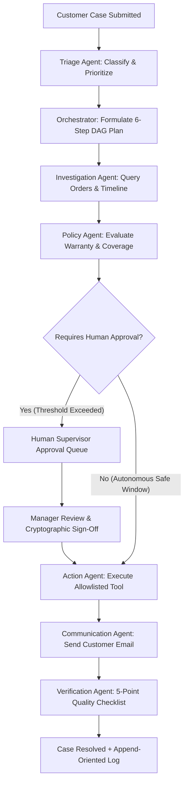

### Core Capabilities

| Capability | ResolveAI Approach |
| :--- | :--- |
| **Planning** | Dynamic 6-step DAG plan generated by the Orchestrator tailored to the specific case type. |
| **Reasoning** | Google Gemini (`gemini-3.5-flash` / `gemini-flash-latest`) with deterministic fallback heuristics. |
| **Evidence** | Investigation Agent queries real CRM profiles, carrier delivery timestamps, and order histories. |
| **Policy** | Policy Agent evaluates exact rules (e.g. 14-day damaged goods window, 30-day unopened returns). |
| **Authorization** | Dual-mode governance: Autonomous execution below monetary limits ($250 default); human approval above. |
| **Execution** | Action Agent operates strictly within a hardcoded allowlist of deterministic internal tools. |
| **Communication** | Communication Agent dispatches responsive HTML emails via Resend with sandbox fallback routing. |
| **Verification** | Verification Agent executes an independent 5-point audit checklist before marking a ticket resolved. |
| **Observability** | Cryptographic append-oriented activity audit stream logging every thought, tool call, and decision. |

---

## 🧠 Why ResolveAI is Actually Agentic

ResolveAI moves beyond passive conversational AI into true autonomous agency:

### Traditional Chatbot vs. ResolveAI

```text
Traditional Chatbot:
User ───> LLM Prompt ───> Conversational Response

ResolveAI Agentic Workflow:
Customer Issue
      ↓
Plan (Formulates Directed Acyclic Graph resolution plan)
      ↓
Delegate (Distributes sub-tasks to specialized domain agents)
      ↓
Investigate (Inspects environment, retrieves CRM orders, checks delivery age)
      ↓
Reason over Evidence (Evaluates legal policy against concrete timeline)
      ↓
Authorize (Evaluates autonomy rules, enforces manager approval gate if needed)
      ↓
Execute (Mutates database state, provisions replacement SKU via internal tools)
      ↓
Communicate (Dispatches transactional email with zero-hallucination evidence)
      ↓
Verify (Independent auditor audits entire execution against 5 quality gates)
      ↓
Persist Outcome (Appends immutable cryptographic log to persistent store)
```

### Real Agentic Characteristics Implemented in Astra-4:
* **Dynamic Planning:** The Orchestrator generates a tailored multi-step execution plan based on the ticket's classification.
* **Autonomous Tool Use:** Agents invoke allowlisted functions (`getOrder`, `searchPolicies`, `createReplacementRequest`, `send_customer_update_email`) with structured arguments.
* **Environment Grounding:** Decisions are grounded in real CRM records, carrier tracking dates, and active policy markdown.
* **Persistent Workflow State:** Workflow steps and state transitions (`OPEN`, `INVESTIGATING`, `WAITING_APPROVAL`, `RESOLVED`) are persisted across restarts.
* **Self-Governing Interlocks:** If the policy conditions are not met or the financial threshold is exceeded, the agent halts and creates an approval request.
* **Separation of Concerns:** The agent that proposes an action cannot verify its own work; an independent Verification Agent audits the resolution.

---

## 🤖 The 8-Agent Supervisory Topology

ResolveAI organizes intelligence into an **8-agent supervisory topology** located in `backend/src/agents/`:

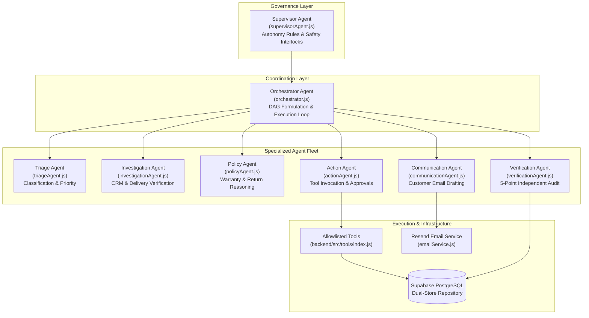

### Agent Fleet Roster

| Agent | Responsibility | Source Implementation | Tools & Subsystems |
| :--- | :--- | :--- | :--- |
| **1. Supervisor Agent** | System-wide autonomy governance, telemetry aggregation, monetary risk assessment, and emergency stop enforcement. | `backend/src/agents/supervisorAgent.js` | `evaluateAutonomy()`, `canAutoApprove()`, `recordEvent()` |
| **2. Orchestrator Agent** | Formulates the 6-step DAG plan, delegates steps sequentially, manages state transitions, and handles rollback. | `backend/src/agents/orchestrator.js` | `runWorkflow()`, `executeNextStep()`, `buildResolutionDossier()` |
| **3. Triage Agent** | Analyzes customer text, extracts sentiment and urgency, and categorizes issue type (`damaged_product`, `late_delivery`, etc.). | `backend/src/agents/triageAgent.js` | `triageTicket()`, Gemini JSON prompt |
| **4. Investigation Agent** | Retrieves customer purchase records, calculates delivery age from carrier timestamps, and builds context dossier. | `backend/src/agents/investigationAgent.js` | `tools.getCustomer`, `tools.getOrder`, `tools.getCustomerOrders` |
| **5. Policy Agent** | Cross-references case evidence with legal policy markdown; evaluates 14-day warranty and damage eligibility. | `backend/src/agents/policyAgent.js` | `tools.searchPolicies`, rule-matching heuristics |
| **6. Action Agent** | Provisions physical replacement requests, updates ticket statuses, or creates human supervisor approval requests. | `backend/src/agents/actionAgent.js` | `tools.createReplacementRequest`, `tools.updateTicketStatus` |
| **7. Communication Agent** | Synthesizes verified evidence into customer-facing emails; enforces strict factual grounding with zero hallucinations. | `backend/src/agents/communicationAgent.js` | `tools.send_customer_update_email`, `emailService` |
| **8. Verification Agent** | Evaluates a 5-point quality checklist before certifying resolution and signing off on ticket closure. | `backend/src/agents/verificationAgent.js` | `verifyResolution()`, audit validation rules |

---

## 🛡️ AI Governance & Autonomous Control

ResolveAI enforces a strict **human-in-the-loop and threshold-governed autonomy model**:

```text
AI Proposes Action (e.g. createReplacementRequest)
      ↓
Policy Validation (Eligible under warranty?)
      ↓
Evidence Validation (Order verified & delivered within warranty?)
      ↓
Monetary Threshold Check (Order value <= $250 configured limit?)
      ↓
   ├── YES ──> Autonomous AI Sign-Off (Logged with supervisor telemetry)
   └── NO  ──> PAUSE Execution & Create Approval Gate
                    ↓
               Operations Manager Reviews Dossier
                    ↓
               Manager Signs Approval (Cryptographic audit logged)
                    ↓
               Action Agent Executes Tool
                    ↓
               Verification Agent Audits Execution
```

### Governance Capabilities Configurable in `/control-center`:
1. **Master Autonomy Toggle:** Switch the entire platform between Fully Supervised (all sensitive actions require human sign-off) and Autonomous Mode.
2. **Financial Threshold Slider:** Dynamically set the maximum monetary value ($0 to $1,000+) that the AI can authorize without human approval.
3. **Emergency Stop Button:** Instantly halts all active autonomous workflows across the system with single-click interlocks.
4. **Pause / Resume Controls:** Temporarily suspend new agent runs while pending approvals are audited.

---

## 🔒 AI Security & Defense-in-Depth

The platform implements defense-in-depth controls across every architectural layer:

| Threat Category | Potential Risk | ResolveAI Defense Mechanism | Source Verification |
| :--- | :--- | :--- | :--- |
| **Prompt Injection** | Customer ticket attempts to override agent instructions | Untrusted customer input is isolated in dedicated data delimiters; system prompts instruct agents to treat input as data only. | `backend/src/services/aiService.js` |
| **AI Hallucinations** | Model invents fake order numbers or unauthorized discounts | Structured Zod output validation; communication templates are strictly grounded in verified database fields. | `backend/src/validators/index.js` |
| **Unauthorized Action** | AI executes arbitrary commands or raw SQL | Hardcoded tool allowlist; tool execution occurs exclusively through registered JavaScript functions with no shell access. | `backend/src/tools/index.js` |
| **Privilege Escalation** | Customer account attempts to access staff console or admin APIs | JWT authentication verified via `requireRole(['admin', 'manager'])` middleware; client redirects cross-role requests. | `backend/src/middleware/authMiddleware.js` |
| **Cross-Tenant Access** | Customer tries to inspect or modify another customer's tickets | Strict session-derived customer ID scoping; unauthorized ticket access returns `403 Forbidden`. | `backend/src/controllers/customerPortalController.js` |
| **Email Header Injection** | Attacker inserts CRLF (`\r\n`) to inject BCC recipients | Header sanitization strips carriage returns and newlines; strict regex validates email syntax. | `backend/src/services/emailService.js` |
| **Duplicate Execution** | Network retries cause double replacement shipments | Idempotency keys generated from ticket ID, event type, and run hash prevent duplicate operations. | `backend/src/services/emailService.js` |
| **Brute-Force Attacks** | Repeated credential guessing on authentication routes | Express rate limiting (`express-rate-limit`) throttles auth attempts with `429 Too Many Requests`. | `backend/src/middleware/rateLimiter.js` |

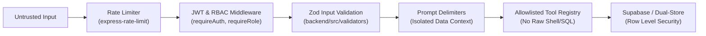

---

## 🎥 Product Demo

> **Watch the complete ResolveAI workflow — from customer issue intake to investigation, policy evaluation, supervisor approval, operational execution, customer email delivery, and independent verification.**

<p align="center">
  <a href="https://astra-4-opal.vercel.app/">
    
  </a>
</p>

<p align="center">
  <em><strong>Interactive Walkthrough:</strong> Multi-agent DAG execution, human-in-the-loop approval gating, warehouse replacement fulfillment, and autonomous case resolution.</em>
</p>

* **Production URL:** [https://astra-4-opal.vercel.app/](https://astra-4-opal.vercel.app/)
* **Timed Demo Script:** A detailed 3-minute hackathon judge walkthrough script is available in [`docs/DEMO_SCRIPT.md`](./docs/DEMO_SCRIPT.md).

---

## 🔑 Demo Credentials

The live deployment and local seed environment provide pre-configured evaluator accounts with **1-click login buttons** on both login pages:

| Role | Portal URL | Demo Credentials | What to Evaluate |
| :--- | :--- | :--- | :--- |
| **Admin** | [`/staff/login`](https://astra-4-opal.vercel.app/staff/login) | `admin@resolveai.io` / `password123` | AI Control Center, autonomy thresholds, email subsystem, system audit logs. |
| **Operations Manager** | [`/staff/login`](https://astra-4-opal.vercel.app/staff/login) | `manager@resolveai.io` / `password123` | Human-in-the-loop approval queue, evidence dossiers, policy management. |
| **Support Agent** | [`/staff/login`](https://astra-4-opal.vercel.app/staff/login) | `agent@resolveai.io` / `password123` | Launch autonomous DAG runs on Case `#tkt-001`, inspect live agent thoughts. |
| **Customer** | [`/customer/login`](https://astra-4-opal.vercel.app/customer/login) | `customer@resolveai.io` / `password123` | Submit cases, link orders, monitor real-time resolution steps, order disputes. |

> *Note: These credentials are intended exclusively for hackathon evaluation and demo environments.*

---

## 📧 Transactional Email System

ResolveAI features an automated transactional email subsystem powered by **Resend** with development sandbox safety routing:

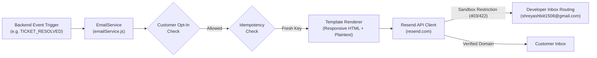

### Supported Transactional Events:
1. `TICKET_CREATED`: Sent when a customer submits a new inquiry.
2. `STATUS_UPDATE`: Sent when investigation progress advances.
3. `APPROVAL_REQUIRED`: Dispatched to operations managers when a sensitive action requires human authorization.
4. `ACTION_COMPLETED`: Sent when warehouse replacement order is provisioned.
5. `FINAL_RESOLUTION`: Comprehensive resolution report with replacement tracking numbers.
6. `ADMIN_TEST`: Verification test dispatch triggered from the Admin Settings console.

---

## 👥 Customer Care Portal

The dedicated customer portal (`/customer`) provides an intuitive consumer experience:

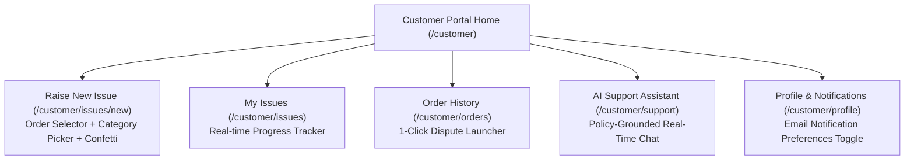

---

## 🏛️ End-to-End System Architecture

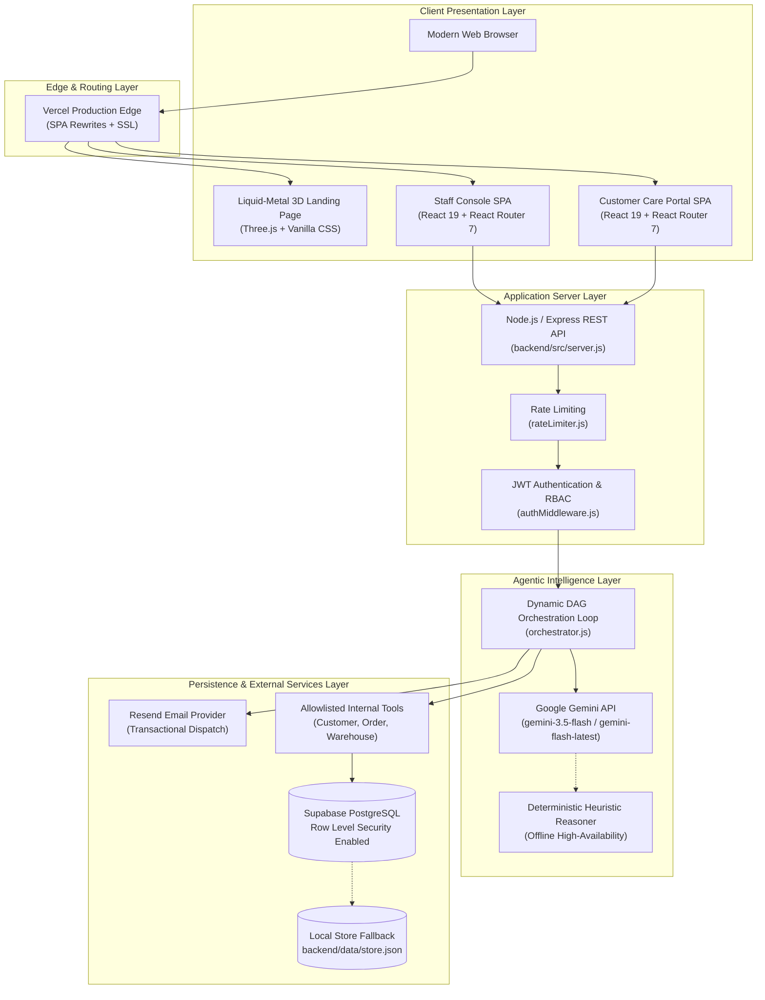

---

## 🔄 End-to-End Workflow Sequence

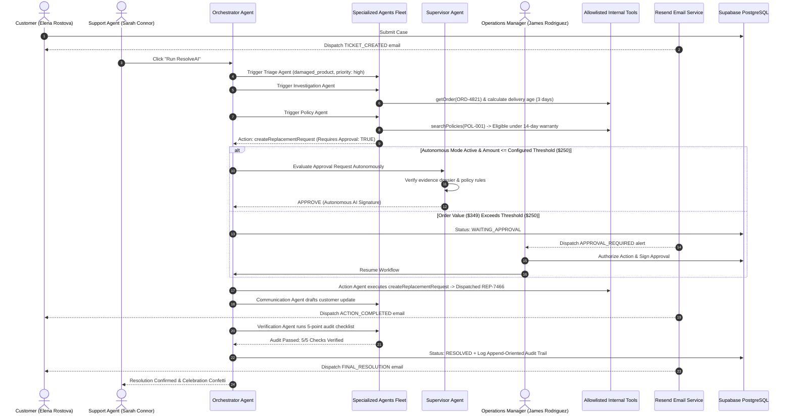

---

## 🖼️ User Interface & Screenshot Gallery

All production screenshots below are available in high resolution under [`docs/screenshots/`](./docs/screenshots/):

### 1. Futuristic Liquid-Metal Landing Page & Art Direction
*Designed according to the strict **Premium Futuristic Liquid-Metal** design system, featuring a responsive Three.js metallic fluid shader canvas, neo-grotesk typography, and full dark/light theme support.*

<p align="center">
  
</p>

<p align="center">
  
</p>

---

### 2. Multi-Tenant Role Gateway & 1-Click Evaluator Authentication
*Zero friction for hackathon evaluators: Dedicated portal selection gateway and one-click role switching for Admin, Manager, and Customer personas.*

<p align="center">
  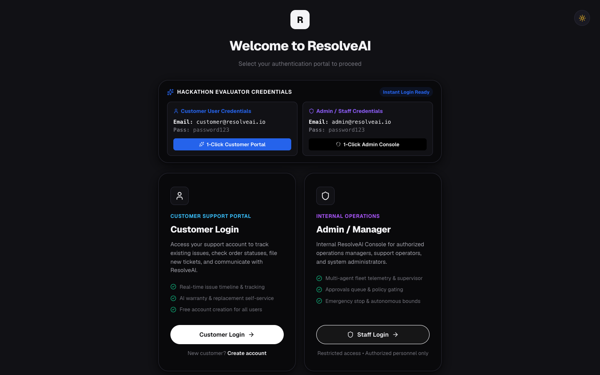
  
</p>

---

### 3. Operations Command Center & 8-Agent Autonomous Fleet Status
*Real-time operational dashboard with system health indicators, live ticket volume trends, resolution rates, and instant fleet supervisory status.*

<p align="center">
  
</p>

<p align="center">
  
</p>

---

### 4. Customer Support Tickets Management
*High-density operations table with live status filtering, category drilldowns, real-time search, customer reference links, and direct ticket workspace launchers.*

<p align="center">
  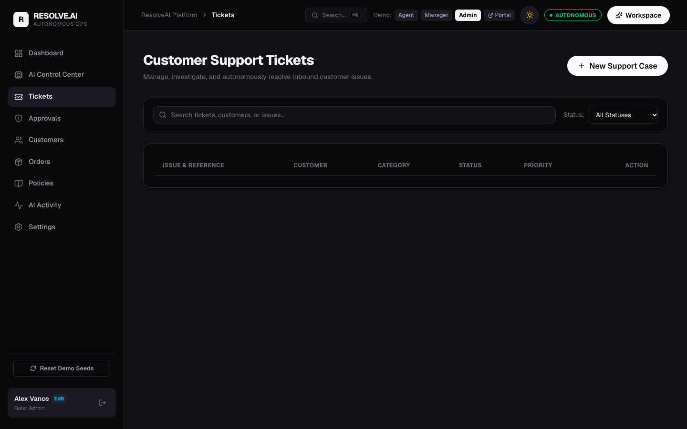
</p>

---

### 5. Autonomous Multi-Agent DAG Investigation & Execution Workspace
*The core autonomous workspace: Watch the 8 agents execute a 6-step Directed Acyclic Graph plan, synthesize customer context, evaluate policies, construct evidence dossiers, and verify resolutions with independent 5-point audits.*

<p align="center">
  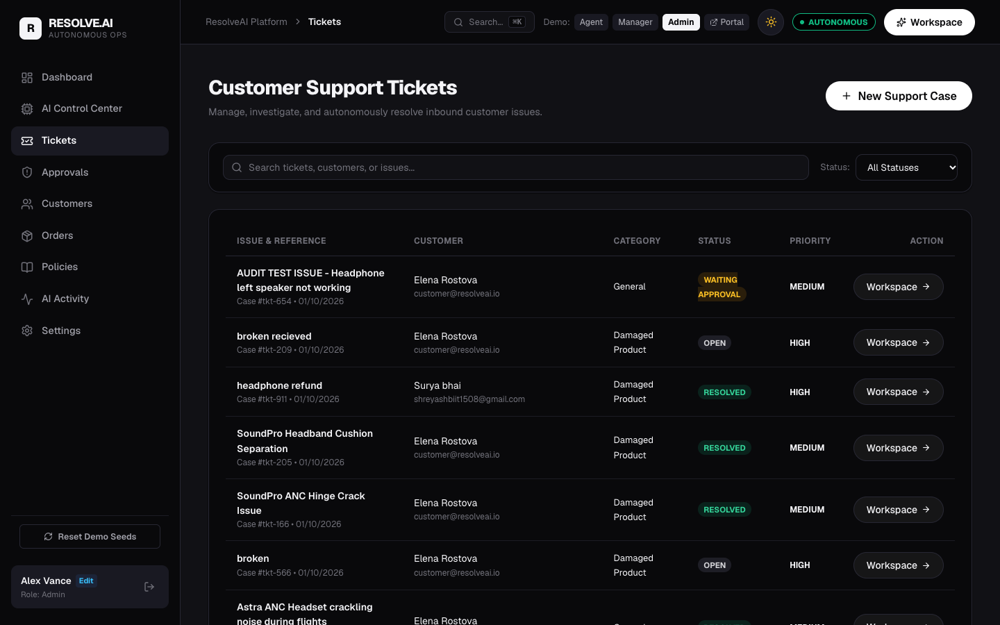
  
</p>

<p align="center">
  
</p>

---

### 6. Human-in-the-Loop Operations Manager Approval Queue
*Strict human supervision for sensitive actions exceeding autonomous thresholds. Managers review structured evidence dossiers, policy justifications, and sign approvals with cryptographic attribution.*

<p align="center">
  
</p>

---

### 7. AI Control Center & Safety Governance
*Configurable autonomy parameters: Master autonomy toggles, monetary threshold sliders ($0 to $1,000+), risk category filters, and supervisor auto-approve rules.*

<p align="center">
  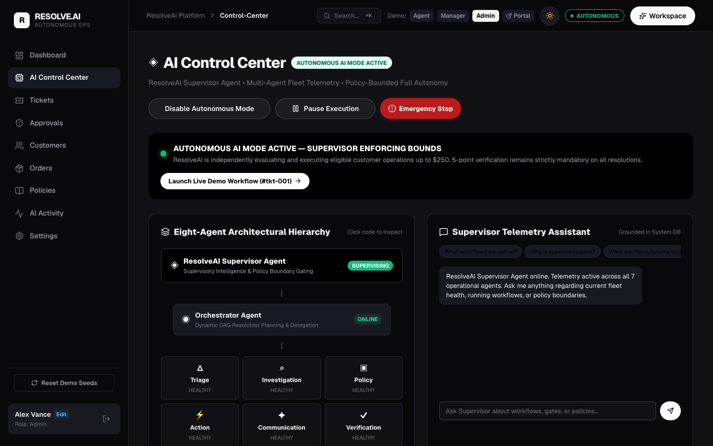
</p>

---

### 8. Cryptographic Append-Oriented Activity & Audit Log
*Immutable, tamper-evident audit stream logging every agent thought, tool execution, customer communication dispatch, and human override with full JSON inspector payloads.*

<p align="center">
  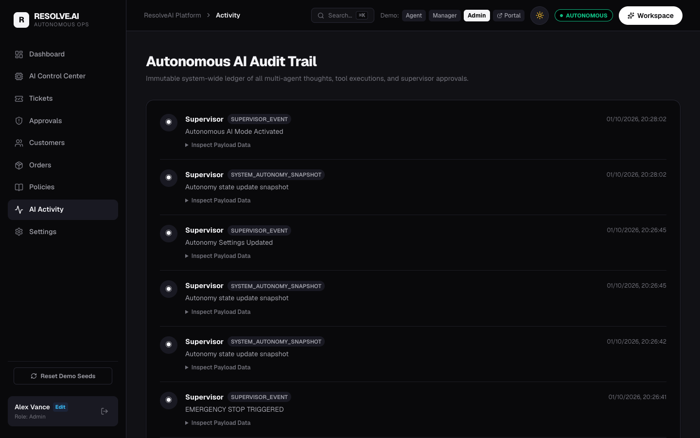
</p>

---

### 9. Platform & Transactional Email Settings Console
*Transactional email configuration with live Resend verification, developer sandbox recipient routing, and dark/light system appearance controls.*

<p align="center">
  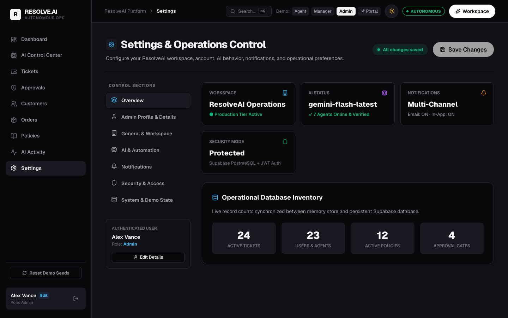
</p>

---

### 10. Customer Care Portal (Consumer Experience)
*Dedicated, accessible end-user experience: Track ongoing inquiries, launch warranty claims with instant order linking, and monitor autonomous resolution steps in real time.*

<p align="center">
  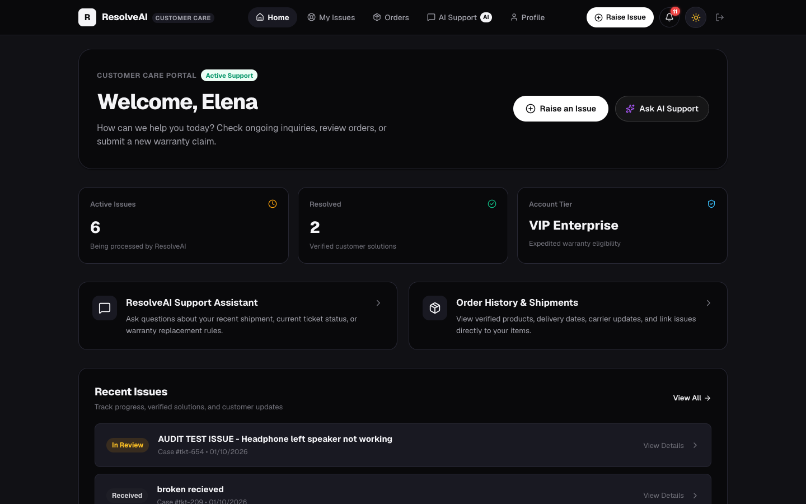
  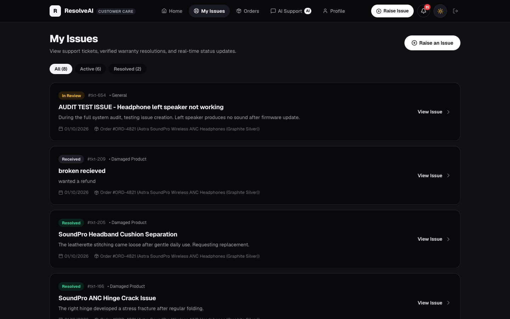
</p>

<p align="center">
  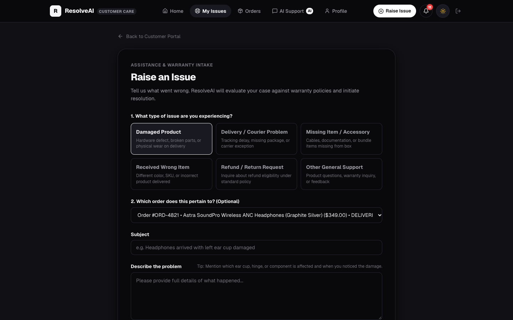
  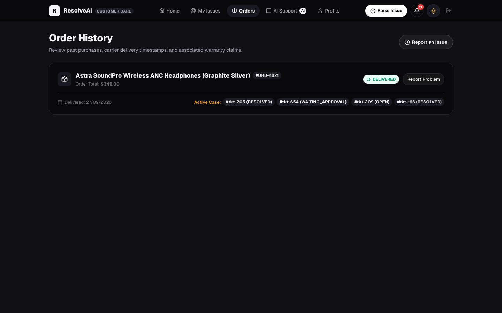
</p>

---

## 🧰 Technology Stack

| Layer | Technology | Version | Purpose in ResolveAI |
| :--- | :--- | :--- | :--- |
| **Frontend Framework** | React | `^19.2.8` | Component architecture, state management, hooks. |
| **Client Router** | React Router DOM | `^7.18.4` | Single-page application routing, protected route wrappers. |
| **Frontend Bundler** | Vite | `^8.3.0` | Build tooling, fast hot module replacement (HMR). |
| **3D Canvas Engine** | Three.js | `^0.186.1` | Procedural liquid-metal hero mesh with `MeshPhysicalMaterial`. |
| **Icons & Visuals** | Lucide React | `^1.49.0` | Consistent iconography across staff and customer views. |
| **Delight Effects** | Canvas Confetti | `^1.9.4` | Particle celebration on issue submission and resolution. |
| **Backend Runtime** | Node.js | `>=18.0.0` | ES Modules runtime (`"type": "module"`). |
| **Web Server** | Express | `^4.21.2` | RESTful API server, middleware pipeline, error handling. |
| **AI LLM Engine** | Google Gemini API | `gemini-3.5-flash` / `gemini-flash-latest` | Agentic reasoning, semantic extraction, decision generation. |
| **Fallback Engine** | Heuristic Reasoner | Custom | Deterministic offline execution guaranteeing uptime during API limits. |
| **Email Provider** | Resend | `^6.31.0` | Transactional email delivery with sandbox routing. |
| **Primary Database** | Supabase PostgreSQL | `^2.49.1` | Relational storage with Row Level Security (RLS). |
| **Fallback Store** | File-backed JSON | Custom | Self-healing local database cache (`backend/data/store.json`). |
| **Schema Validation** | Zod | `^3.24.2` | Strict schema validation for API inputs and agent outputs. |
| **Authentication** | JWT + bcryptjs | `^9.0.2` / `^3.0.2` | Token-based authentication and password hashing. |
| **Rate Limiting** | express-rate-limit | `^8.7.0` | Protection against abuse on public endpoints. |

---

## 📁 Project Structure

```text
Astra-4/
├── backend/
│   ├── src/
│   │   ├── agents/               # 8-Agent Supervisory Topology
│   │   │   ├── actionAgent.js
│   │   │   ├── communicationAgent.js
│   │   │   ├── investigationAgent.js
│   │   │   ├── orchestrator.js
│   │   │   ├── policyAgent.js
│   │   │   ├── supervisorAgent.js
│   │   │   ├── triageAgent.js
│   │   │   └── verificationAgent.js
│   │   ├── config/               # Environment & configuration parsing
│   │   ├── controllers/          # Request handlers for staff & customer APIs
│   │   ├── db/                   # Supabase client & dual-store repository
│   │   ├── middleware/           # Auth, RBAC, rate limiter, error handling
│   │   ├── routes/               # Modular Express API route definitions
│   │   ├── services/             # Gemini AI service & Resend email service
│   │   ├── tools/                # Allowlisted internal execution tools
│   │   ├── validators/           # Zod schemas for input & agent output
│   │   └── server.js             # Express application entry point
│   ├── test/                     # Automated test suites
│   ├── render.yaml               # Render cloud deployment blueprint
│   └── package.json
├── frontend/
│   ├── src/
│   │   ├── components/           # UI components (HeroCanvas, Navbar, Modal, etc.)
│   │   ├── context/              # AuthContext and ThemeContext
│   │   ├── layouts/              # DashboardLayout and CustomerLayout
│   │   ├── pages/                # Staff and Customer application pages
│   │   ├── services/             # Frontend API client and Supabase auth helper
│   │   ├── App.jsx               # Protected routes and navigation tree
│   │   └── main.jsx
│   ├── index.html
│   ├── vercel.json               # Vercel SPA routing rules
│   └── package.json
├── docs/
│   ├── screenshots/              # 20 High-res production screenshots & demo GIF
│   └── DEMO_SCRIPT.md            # Timed 3-minute hackathon judge demo script
├── scripts/                      # Screenshot automation scripts
├── supabase-schema.sql           # Complete Supabase PostgreSQL DDL & RLS schema
├── vercel.json                   # Root deployment configuration
├── .env.example                  # Documented environment variable template
├── LICENSE                       # MIT License
└── package.json                  # Root monorepo scripts
```

---

## 🔌 REST API Documentation

All endpoints are hosted at `/api` and return standardized JSON responses.

### 1. Authentication (`/api/auth`)
* `POST /api/auth/register` — Register a new user account (Customer role).
* `POST /api/auth/login` — Authenticate credentials and receive a JWT session token.
* `POST /api/auth/forgot-password` — Request password reset instructions.
* `POST /api/auth/reset-password` — Reset password using verification token.
* `GET  /api/auth/me` — Retrieve current authenticated user profile (`requireAuth`).
* `PATCH /api/auth/me` — Update current user details (`requireAuth`).

### 2. Tickets & Multi-Agent Execution (`/api/tickets`)
* `GET    /api/tickets` — List support tickets with status/category filtering (`agent`, `manager`, `admin`).
* `POST   /api/tickets` — Create a new support ticket (`requireAuth`).
* `GET    /api/tickets/:id` — Retrieve comprehensive ticket details and evidence dossier.
* `PATCH  /api/tickets/:id` — Update ticket properties (`status`, `priority`, `assigned_to`).
* `DELETE /api/tickets/:id` — Delete ticket record (`admin` only).
* `POST   /api/tickets/:id/run` — Launch the autonomous 8-agent workflow (`aiWorkflowLimiter`).
* `GET    /api/tickets/:id/runs` — Fetch execution runs and step-by-step agent thoughts.
* `POST   /api/tickets/:id/assign` — Assign ticket to a staff member.
* `POST   /api/tickets/:id/notes` — Add internal staff note.
* `POST   /api/tickets/:id/send-update` — Send manual customer update email via Resend (`emailRateLimiter`).
* `GET    /api/tickets/:id/emails` — Retrieve email delivery logs for a specific ticket.

### 3. Human Approval Gate (`/api/approvals`)
* `GET  /api/approvals` — List pending, approved, and rejected approval requests.
* `POST /api/approvals/:id/evaluate` — Evaluate approval request against policy rules.
* `POST /api/approvals/:id/ai-decide` — Trigger autonomous AI supervisor evaluation (`manager`, `admin`).
* `POST /api/approvals/:id/approve` — Human manager approval with cryptographic attribution (`manager`, `admin`).
* `POST /api/approvals/:id/reject` — Human manager rejection with reason (`manager`, `admin`).

### 4. AI Control Center & Autonomy Governance (`/api/autonomy`)
* `GET   /api/autonomy/settings` — Get current autonomy mode and financial threshold ($250 default).
* `PATCH /api/autonomy/settings` — Update financial thresholds and risk categories (`manager`, `admin`).
* `POST  /api/autonomy/enable` — Enable full autonomous agent execution (`manager`, `admin`).
* `POST  /api/autonomy/disable` — Disable autonomous mode (enforce 100% human sign-off).
* `POST  /api/autonomy/pause` — Temporarily pause all autonomous execution loops.
* `POST  /api/autonomy/resume` — Resume paused execution loops.
* `POST  /api/autonomy/emergency-stop` — Emergency stop halting all agent activity immediately.

### 5. Supervisor Fleet Telemetry (`/api/supervisor`)
* `GET  /api/supervisor/status` — Fleet health status, uptime, and active agent metrics.
* `GET  /api/supervisor/agents` — Real-time telemetry for all 8 specialized agents.
* `GET  /api/supervisor/workflows` — Active DAG workflow execution states.
* `GET  /api/supervisor/events` — Event stream of supervisor governance decisions.
* `POST /api/supervisor/query` — Natural language telemetry query interface.

### 6. Transactional Email System (`/api/emails`)
* `GET  /api/emails/status` — Status of Resend email provider and delivery counters.
* `POST /api/emails/test` — Admin-only test email sent exclusively to verified developer inbox.
* `GET  /api/emails/logs` — Audit log of outbound transactional emails.
* `POST /api/emails/:id/retry` — Retry failed email notification.

### 7. Customer Portal (`/api/customer`)
* `GET    /api/customer/me` — Authenticated customer profile and preferences.
* `PATCH  /api/customer/preferences` — Toggle email notification preferences.
* `GET    /api/customer/tickets` — List customer's own tickets (scoped to session).
* `POST   /api/customer/tickets` — Submit a new customer case.
* `GET    /api/customer/tickets/:id` — Customer ticket view with step progress.
* `GET    /api/customer/tickets/:id/timeline` — Customer-facing sanitized timeline.
* `GET    /api/customer/orders` — Customer order history and carrier statuses.
* `GET    /api/customer/notifications` — In-app notifications list.
* `PATCH  /api/customer/notifications/:id/read` — Mark notification as read.
* `POST   /api/customer/notifications/mark-all-read` — Mark all notifications as read.
* `POST   /api/customer/chat` — Real-time customer support assistant chat.

### 8. System & Policies (`/api/policies`, `/api/orders`, `/api/system`)
* `GET   /api/policies` — List active operational policies.
* `POST  /api/policies` — Create a new operational policy (`manager`, `admin`).
* `GET   /api/orders` — Search and list e-commerce customer orders.
* `GET   /api/activity` — Append-oriented activity and audit log stream.
* `GET   /api/system/health` — System health check, database ping, and environment status.
* `POST  /api/system/reset` — Reset database to initial seed dataset (`admin` only).

---

## 🗄️ Database Architecture & Dual-Store Engine

ResolveAI implements a **dual-store database engine** defined in `backend/src/db/repository.js` that guarantees zero downtime:

1. **Production Mode (Supabase PostgreSQL):** Full relational database with indexed tables and Row Level Security (RLS) policies.
2. **Offline / Fallback Mode (File-backed Local JSON):** In-memory storage backed by `backend/data/store.json` with initial seed data.

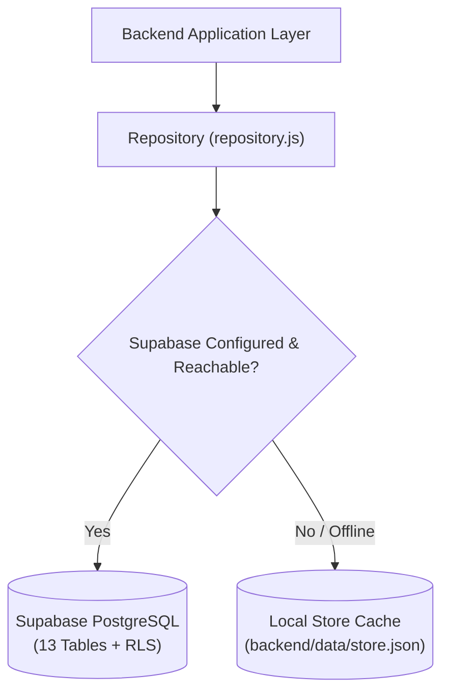

### Database Entity Dictionary

| Entity / Table | Description |
| :--- | :--- |
| `users` | System user accounts, hashed passwords, roles (`customer`, `agent`, `manager`, `admin`). |
| `customers` | Customer CRM profiles, lifetime value, email preferences, addresses. |
| `orders` | E-commerce purchase orders, line items, pricing, carrier tracking numbers, delivery dates. |
| `policies` | Deterministic company policies (e.g. `POL-001 Damaged Product Replacement Policy`). |
| `tickets` | Support cases, customer descriptions, status, priority, resolution summaries. |
| `agent_runs` | Individual multi-agent workflow executions with timing and outcome metrics. |
| `agent_steps` | Granular DAG execution steps, agent thoughts, input parameters, tool outputs. |
| `approvals` | Human-in-the-loop and autonomous approval records with evidence dossiers and signatures. |
| `audit_logs` | Cryptographic append-oriented activity audit stream. |
| `email_notifications` | Transactional email records, Resend message IDs, idempotency keys, delivery status. |
| `autonomy_settings` | Global autonomy mode, financial thresholds ($250 default), safety limits. |
| `supervisor_events` | Telemetry logs of supervisor risk assessments and interlocks. |
| `agent_health` | Real-time health, memory, and latency metrics for all 8 agents. |

---

## 🔐 Authentication & Role-Based Access Control (RBAC)

Authentication uses JSON Web Tokens (JWT) signed with a server-side secret, combined with bcrypt password hashing:

### Role Permission Matrix

| Operation | Customer | Support Agent | Operations Manager | System Admin |
| :--- | :---: | :---: | :---: | :---: |
| **Customer Portal Access** | ✅ | — | — | — |
| **Submit Customer Issues** | ✅ | — | — | — |
| **Staff Dashboard Access** | — | ✅ | ✅ | ✅ |
| **View Tickets & Orders** | Scoped | ✅ | ✅ | ✅ |
| **Run Autonomous AI Workflow** | — | ✅ | ✅ | ✅ |
| **Authorize Approvals** | — | — | ✅ | ✅ |
| **Manage Company Policies** | — | — | ✅ | ✅ |
| **Configure Autonomy Settings** | — | — | ✅ | ✅ |
| **Reset Database Seeds** | — | — | — | ✅ |
| **Trigger Admin Test Emails** | — | — | — | ✅ |

---

## ⚙️ Environment Variables

Copy the template from `.env.example` to `.env`:

```bash
cp .env.example .env
```

### Backend Configuration (`.env`)

```env
# Server Port
PORT=5001
NODE_ENV=development

# JWT Secret for Session Authentication (Must be a secure random string)
JWT_SECRET=replace-with-a-secure-random-secret

# Google Gemini API Key (Get from: https://aistudio.google.com/app/apikey)
# If left empty, system operates using deterministic heuristic reasoner
GEMINI_API_KEY=your-gemini-api-key

# Supabase PostgreSQL Configuration
# Found in Supabase Dashboard -> Project Settings -> API
SUPABASE_URL=https://your-project-ref.supabase.co
SUPABASE_SERVICE_ROLE_KEY=your-supabase-service-role-key
SUPABASE_ANON_KEY=your-supabase-anon-key

# Transactional Email Provider (Resend)
# Get from: https://resend.com/api-keys
RESEND_API_KEY=re_your_resend_api_key
EMAIL_FROM=ResolveAI <onboarding@resend.dev>
EMAIL_REPLY_TO=support@yourdomain.com
MANAGER_NOTIFICATION_EMAIL=manager@yourdomain.com
EMAIL_MODE=provider

# Frontend URL (For CORS allowlisting)
FRONTEND_URL=http://localhost:5173
```

### Frontend Configuration (`frontend/.env`)

```env
# Backend API Base URL
VITE_API_URL=http://localhost:5001/api

# Client-Side Supabase Keys (Row Level Security protected)
VITE_SUPABASE_URL=https://your-project-ref.supabase.co
VITE_SUPABASE_ANON_KEY=your-supabase-anon-key
```

> **Security Reminder:** Never commit `.env`, private API keys, or service role tokens to version control.

---

## 💻 Local Installation & Setup

### Prerequisites
* **Node.js:** `>=18.0.0`
* **npm:** `>=9.0.0`
* **Git**

### 1. Clone the Repository
```bash
git clone https://github.com/shreyash-bhosale/Astra-4.git
cd Astra-4
```

### 2. Install Dependencies
```bash
# Install backend dependencies
cd backend
npm install

# Install frontend dependencies
cd ../frontend
npm install
cd ..
```

### 3. Configure Environment Variables
```bash
cp .env.example .env
# Edit .env with your configuration keys (optional - offline fallback works out-of-the-box)
```

### 4. Seed the Database
```bash
npm run seed
```

### 5. Launch the Platform
In two separate terminals:

```bash
# Terminal 1: Start Backend Server (runs on http://localhost:5001)
npm run dev:backend

# Terminal 2: Start Frontend Application (runs on http://localhost:5173)
npm run dev:frontend
```

Alternatively, run both concurrently from the root directory:
```bash
npm run dev
```

### 6. Verify System Health
Open your browser and navigate to:
* **Frontend Web App:** `http://localhost:5173/`
* **Backend Health Check:** `http://localhost:5001/api/health`

---

## 🧪 Testing & Verification Evidence

ResolveAI includes automated verification test suites validating authentication, agent orchestration, security boundaries, and email delivery:

```text
┌──────────────────────────────────────────────────────────────┐
│                  VERIFIED TEST SUITES                        │
├──────────────────────────────────────────────────────────────┤
│ Security & Role Authorization │ 6 / 6 Test Cases Passed      │
│ Transactional Email Suite     │ 21 / 21 Test Cases Passed    │
│ Orchestrator Autonomous Flow  │ Complete Flow Verified       │
│ Full System Audit Suite       │ 23 / 23 Assertions Passed    │
│ Frontend Production Build     │ 0 Build Errors (Vite v8.3)   │
└──────────────────────────────────────────────────────────────┘
```

### 1. Security & Role Authorization Suite
```bash
node backend/test/security-authorization.test.js
```
* Unauthenticated access blocked (`401 Unauthorized`)
* Tampered JWT rejected (`401 Unauthorized`)
* Agent role prevented from approving actions (`403 Forbidden`)
* Agent role prevented from creating policies (`403 Forbidden`)
* Manager role authorized to create policies (`201 Created`)
* Rate limiter mitigates brute-force attacks (`429 Too Many Requests`)

### 2. Transactional Email System Test Suite
```bash
node backend/test-email-feature.js
```
* CRLF email header injection prevention verified
* Recipient email syntax validation
* Responsive HTML and plaintext template rendering
* Automatic event dispatch (`TICKET_CREATED`, `APPROVAL_REQUIRED`, `FINAL_RESOLUTION`)
* Idempotency check prevents duplicate email sends
* Resend sandbox fallback routing to verified developer inbox
* Database audit trail logging verified

### 3. Orchestrator End-to-End Workflow Test
```bash
node backend/test-orchestrator-email-flow.js
```
* Full case lifecycle: Ticket created -> Triage -> Investigation -> Policy -> Action -> Email -> Verification -> Resolved.

### 4. Frontend Production Build
```bash
cd frontend && npm run build
```
* Verifies zero JSX/JS build errors, minifies assets, and validates client routing.

---

## 🚢 Production Deployment Guide

ResolveAI is designed for zero-config production deployment across standard cloud providers:

### Frontend — Vercel
1. Set **Framework Preset** to `Vite`.
2. Set **Root Directory** to `frontend`.
3. Set **Build Command** to `npm run build`.
4. Set **Output Directory** to `dist`.
5. Add Environment Variable:
   ```env
   VITE_API_URL=https://your-backend-domain.com/api
   ```

### Backend — Render / Railway
A pre-configured [`render.yaml`](./backend/render.yaml) is included in `backend/`:
1. Connect repository to Render.
2. Select **Web Service** with Node runtime.
3. Set **Root Directory** to `backend`.
4. Set **Build Command** to `npm install`.
5. Set **Start Command** to `node src/server.js`.
6. Add environment variables: `PORT=5001`, `JWT_SECRET`, `GEMINI_API_KEY`, `SUPABASE_URL`, `SUPABASE_SERVICE_ROLE_KEY`, `RESEND_API_KEY`, `FRONTEND_URL`.

---

## 🎬 3-Minute Hackathon Judge Demo

Follow this exact 3-minute walkthrough during hackathon evaluation:

| Time | Stage | Evaluator Action | What the Judge Sees |
| :--- | :--- | :--- | :--- |
| **0:00–0:30** | **Product & Material Language** | Open [Live Demo](https://astra-4-opal.vercel.app/) and observe liquid-metal hero. | Premium Three.js 3D fluid canvas, high-fashion editorial typography, 8-agent fleet overview. |
| **0:30–1:00** | **Autonomous Case Run** | Click **"Staff Portal"** -> **"1-Click Admin"** -> Open Case `#tkt-001` -> Click **"Run ResolveAI"**. | Live 6-step DAG execution: Triage classifies `damaged_product`, Investigation queries Order `#ORD-4821`, Policy evaluates 14-day warranty. |
| **1:00–1:45** | **Human Approval Gate** | Watch workflow halt at yellow **Supervisor Approval Gate** banner. | Safe autonomy in action: Replacement order value ($349) exceeds threshold ($250). Evidence dossier presented for review. |
| **1:45–2:15** | **Manager Authorization** | Click **"Authorize Action & Resume"**. Confetti fires. | Workflow resumes: Action Agent provisions replacement `#REP-XXXX`, Communication Agent sends email, Verification Agent audits 5 criteria. |
| **2:15–2:45** | **AI Governance** | Navigate to `/control-center` in the sidebar. | Autonomy mode toggle, monetary threshold slider ($0–$1,000), Emergency Stop interlock, Supervisor telemetry. |
| **2:45–3:00** | **Customer Experience** | Log in as Customer via `/customer/login` -> **"1-Click Customer Sign In"**. | Customer Care Portal: Real-time issue tracking, confetti celebration on new inquiries, order dispute launcher. |

### 100-Word Demo Narrative:
> *"ResolveAI is not another conversational chatbot that generates polite excuses. It is an autonomous customer operations engine. When a customer reports a damaged product, ResolveAI formulates a multi-step execution plan, verifies order timestamps and carrier tracking, evaluates warranty policy, and—because replacing hardware involves physical inventory—halts at a human approval gate. Once authorized, it executes the warehouse replacement tool, sends an idempotent confirmation email via Resend, and audits the resolution across a 5-point quality checklist before closing the case. This is enterprise-grade, human-supervised autonomy."*

---

## 🧭 Project Highlights

```text
┌───────────────────────────────────────────────────────────────┐
│                         RESOLVE.AI                            │
├───────────────────────────────────────────────────────────────┤
│                                                               │
│   🤖 8-Agent Supervisory Topology                             │
│   🧠 Dynamic Directed Acyclic Graph (DAG) Planning            │
│   🛡️ Dual-Mode AI Governance & Human Approval Gates           │
│   🔐 Defense-in-Depth Security (RBAC, Rate Limiting, Sanitization) │
│   📊 Real-Time Operations Command Center & Fleet Telemetry    │
│   📧 Automated Transactional Email Delivery (Resend)          │
│   👥 Dual Experience: Staff Operations + Customer Care Portal │
│   🗄️ Supabase PostgreSQL + Local Dual-Store Resilience        │
│   🎨 Premium Futuristic Liquid-Metal Three.js Art Direction   │
│   🚀 Verified Live Production Deployment                      │
│                                                               │
└───────────────────────────────────────────────────────────────┘
```

---

## 📊 Feature Matrix

| Feature / Subsystem | Implementation Status | Notes |
| :--- | :---: | :--- |
| **8-Agent Architecture** | ✅ Verified | Supervisor, Orchestrator, Triage, Investigation, Policy, Action, Communication, Verification. |
| **Dynamic DAG Planning** | ✅ Verified | 6-Step resolution plan formulated dynamically per ticket. |
| **Human Approval Gate** | ✅ Verified | Evidence dossier review, manager sign-off, cryptographic audit logging. |
| **Autonomous Approval Gate** | ✅ Verified | Configurable monetary threshold ($250 default) evaluated by Supervisor Agent. |
| **Google Gemini Integration** | ✅ Verified | `gemini-3.5-flash` / `gemini-flash-latest` with deterministic fallback. |
| **Customer Care Portal** | ✅ Verified | `/customer` routes: intake, step tracker, orders, AI support, notifications. |
| **Staff Operations Console** | ✅ Verified | `/dashboard`, `/tickets`, `/approvals`, `/control-center`, `/activity`, `/settings`. |
| **Transactional Email** | ✅ Verified | Resend API integration with developer sandbox fallback routing. |
| **Supabase PostgreSQL** | ✅ Verified | Relational database with 13 tables, indexes, and Row Level Security. |
| **Role-Based Access (RBAC)** | ✅ Verified | `customer`, `agent`, `manager`, `admin` roles with route middleware. |
| **Three.js Liquid-Metal Canvas** | ✅ Verified | Interactive WebGL procedural mesh with dark and light theme shaders. |
| **Live Production Deployment** | ✅ Verified | Vercel edge deployment at `https://astra-4-opal.vercel.app/`. |

---

## 👥 Team

Built with passion for the **Agentic AI & Intelligent Systems Hackathon**:

| Member | Role | Focus Areas |
| :--- | :--- | :--- |
| **Sparsh Shrivastav** | Team Leader | Product architecture, agent orchestration, system integration. |
| **Shreyash Bhosale** | Engineer | Backend infrastructure, Supabase persistence, security, deployment. |
| **Vatsal Pithwa** | Engineer | Multi-agent DAG workflows, policy reasoning, AI service integration. |
| **Uzair Pathan** | Engineer | Frontend architecture, Three.js liquid-metal canvas, customer portal. |

---

## 📄 License

This project is licensed under the **MIT License**. See the complete [LICENSE](./LICENSE) file for details.

---

## ⚡ Footer

<div align="center">

# ⚡ RESOLVE.AI

### From customer issue to verified resolution — autonomously.

[🚀 Live Production Demo](https://astra-4-opal.vercel.app/) &nbsp;·&nbsp; [💻 GitHub Repository](https://github.com/shreyash-bhosale/Astra-4) &nbsp;·&nbsp; [🎬 Demo Walkthrough](#-product-demo)

*Built with React 19, Node.js, Express, Three.js, Google Gemini, Supabase PostgreSQL, Resend, and an 8-Agent Supervisory Topology.*

</div>
